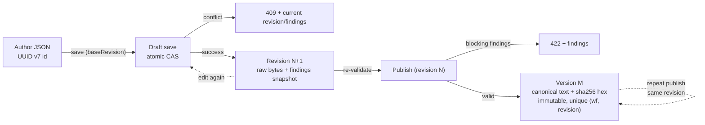

# E1-S3 decision: Draft revision and publication lifecycle

| Tracking | Value |
| --- | --- |
| Status | Proposed — awaiting approval |
| Source | [E1-S3: Decide how drafts become published versions](../../tasks/epic-01/e1-s3-define-draft-publication-lifecycle.md) |
| Last updated | 2026-08-16 |

## Decision

Rostrum identifies each workflow by the UUID v7 `id` inside the authored document; the author supplies it and the server validates it. A workflow has exactly one draft in Epic 1 — the draft is the workflow's working copy, identified by the same `id`. Draft revisions are per-workflow monotonic integers (1, 2, 3, …) assigned by the server on each successful save. Published versions are per-workflow monotonic integers assigned on each successful publish. The digest is SHA-256 (lowercase hex) over the RFC 8785 canonical form of the document.

Any syntactically valid JSON saves as a draft even when validation reports blocking findings; parse failures (invalid JSON, duplicate keys, `NaN`/`Infinity`, invalid UTF-8) are errors, not drafts. Saves use an optimistic revision check: the client sends the revision it last saw (`baseRevision`), and the server commits only if it equals the current latest; otherwise the save fails with a 409 and the current revision and findings. Drafts are stored as the exact bytes submitted and retrieved unchanged.

An author publishes by selecting a revision. Publication re-runs validation on the stored content; blocking findings reject the publish (422) without creating anything. A valid revision is canonicalized once (RFC 8785) and stored as an immutable published version with its digest. A revision publishes at most once; repeating a publish returns the existing version (idempotent), and concurrent publishes of the same revision return the same single version. The draft remains editable after publication; published versions never change.



## Context

E1-S1 fixed the authored workflow shape and explicitly excluded lifecycle fields: "creation time, revision, published-version identity, and digest are server-managed and belong to E1-S3, not to the workflow JSON an author writes." E1-S1's "all identifiers are UUID v7" statement covers the authored document; this record therefore assigns lifecycle identifiers freely (integers chosen below). E1-S0 fixed Postgres with transactional primitives and stated that "revision-check and publication atomicity semantics are designed by E1-S3 and implemented and tested by E1-07."

Epic 01 mandates: drafts save despite blocking findings; single-editor semantics; the draft remains available after publication; published versions are immutable; editing a draft after publication leaves published versions unchanged.

The consumers of these rules are the Control API (E1-06), the shared workflow library's publication preparation (E1-04), the storage layer (E1-07), the conformance suites (E2-07, E3-08), and the Cloud control plane, which reimplements the same contract — hence the digest must be reproducible across implementations from the document alone.

Full option analysis with per-option pros and cons is recorded in the research doc [E1-S3 lifecycle options](../../research/e1-s3-draft-publication-lifecycle-options.md).

## Why these choices

| Aspect | Choice | Reason |
| --- | --- | --- |
| Workflow identity | Author-supplied UUID v7 `id`, validated by the server | E1-S1 made `id` required in the authored document; automated authors mint UUID v7 offline; every save is a save of a self-identifying document with no special create flow |
| Draft identity | The workflow `id`; one draft per workflow | Epic 1 is single-editor; a separate draft id adds a mapping with no consumer |
| Revision identity | Per-workflow monotonic integer | Human-addressable, trivially ordered, makes the revision check a plain equality; UUID v7 gives no ordering or debugging advantage here |
| Published-version identity | Per-workflow monotonic integer | Matches E1-S1's "published-version number"; "run version 3" is the execution-request mental model; semver adds no semantics (interface compatibility is `interfaceVersion`'s job, E1-S4) |
| Revision check | Optimistic `baseRevision` CAS in one transaction | Stateless clients, retry-friendly for automated authors; pessimistic locks force client statefulness and lock-lifecycle management for no benefit in Epic 1 |
| Draft storage | Exact submitted bytes | E1-07 requires retrieval "unchanged"; findings' line/column (E1-S2) stay anchored to the author's text |
| Published storage | RFC 8785 canonical text + digest | The published version is one deterministic byte form; verification is `sha256(retrieved) == digest` |
| Publication selection | Revision number, always re-validated at publish | "Select a revision for publication" is the task's wording; re-validation makes "published ⇒ validated" a server-enforced invariant |
| Repeated publication | At most once per revision; repeat returns the existing version | Idempotent and conflict-free by construction (unique `(workflow_id, revision)`); rollback stays expressible by saving old content as a new revision |
| Normalization | RFC 8785 (JCS) | The only standard canonical JSON; every target implementation (Bun runtime, Cloud control plane, conformance harness) has a JCS implementation; digests are reproducible across languages |
| Hash | SHA-256, lowercase hex | Ubiquitous, FIPS, hardware-accelerated; hex is the content-digest convention (git, Docker) |
| Digest scope | The entire canonical document | "Exact version retrieved and verified" without exclusion rules; identical documents hash identically even across workflows |
| Draft after publication | Remains editable; publication is a copy, never a move/delete | Epic 01 mandates the draft stays available; immutable version rows make later edits trivially safe |

## Specification outline

### Identifier model

| Identifier | Type | Assigned by | Scope | Changes when |
| --- | --- | --- | --- | --- |
| Workflow `id` | UUID v7 | Author (server-validated) | Workspace | First save (authored); never again |
| Draft | = workflow `id` | — | One per workflow | — |
| Revision | integer ≥ 1 | Server | Per workflow | +1 per successful save, in commit order |
| Published version | integer ≥ 1 | Server | Per workflow | +1 per successful publish |
| Digest | SHA-256 hex (64 chars) | Server | Content | Deterministic on content; immutable once stored |
| `createdAt` / `updatedAt` | `timestamptz` | Server/DB `now()` | Per row | At save/publish |

### Save contract

- **Eligibility:** any syntactically valid JSON saves as a draft, including documents with blocking validation findings. Parse failures — invalid JSON, duplicate keys, `NaN`/`Infinity`, invalid UTF-8 — are 400 errors, not drafts. Duplicate-key rejection is a shared rule: deterministic digests are impossible under last-wins parsing, so E1-S2 must select "reject" as the duplicate-key rule.
- **Identity rule:** the workflow the API addresses is authoritative. If the submitted document is an object and embeds an `id`, it must equal the addressed workflow `id`; a mismatch is a 400/409 identity conflict, never a silent cross-workflow write. A document without an `id` is saveable with a blocking finding.
- **Revision check:** updates carry `baseRevision` (the revision the client last saw). The server commits only when `baseRevision` equals the current latest revision; otherwise 409 with the current revision and findings. The first save has no `baseRevision`.
- **Atomicity:** one transaction: conditional update (`UPDATE workflows SET current_revision = current_revision + 1 WHERE id = $1 AND current_revision = $base` — no row ⇒ conflict), insert the revision row with content and the findings snapshot, with a unique index `(workflow_id, revision)` as backstop.
- **Findings:** recomputed on every save and stored with the revision, so retrieval returns findings without re-validation.
- **Content:** the exact submitted bytes are stored; retrieval returns them unchanged.

### Publish contract

- The author selects a revision by number. The server reads the stored revision and re-runs validation on its content.
- Nonexistent revision ⇒ 404. Blocking findings ⇒ 422 with findings; nothing is created. Valid ⇒ canonicalize (RFC 8785), store the canonical text and `digest = sha256(canonical text)` as an immutable version row.
- The response carries the workflow `id`, published version number, `interfaceVersion`, and digest (E1-06 contract).
- Unique `(workflow_id, revision)` in `published_versions`: a revision publishes at most once. A repeated publish of the same revision returns the existing version (idempotent). Concurrent publishes of the same revision both return the same single version: the loser of the unique-index race re-reads and returns the winner's row.

### Repeated publication and version conflicts

| Scenario | Result |
| --- | --- |
| Publish with blocking findings | 422 + findings; no version created; draft untouched |
| Publish nonexistent revision | 404 |
| Publish already-published revision | 200, existing version returned (idempotent) |
| Concurrent publishes of the same revision | Both succeed; both return the same single version |
| Save with stale `baseRevision` | 409 + current revision/findings; no partial write |
| Save with embedded `id` ≠ addressed workflow | 400/409 identity conflict |
| Editing a draft after publication | New revision; published versions byte-unchanged |

### Normalization and digest

- Canonicalization is **RFC 8785 (JSON Canonicalization Scheme)**, pinned by reference: member names sorted lexicographically by UTF-16 code units; numbers serialized as the shortest IEEE-754 round-trip (ES `Number::toString`: `1.0`→`1`, `-0`→`0`); strings minimally escaped (`"`, `\`, control characters; `\u0041` and `A` both canonicalize to `A`); no whitespace; `NaN`/`Infinity` rejected.
- Input must be duplicate-key-free (see Save contract). Unicode is **not** normalized: NFC and NFD forms of the same text produce different digests — defined behavior, stated for fixture authors.
- **Digest = SHA-256 (lowercase hex) over the entire canonical document**, including `interfaceVersion`, `id`, `name`, `description`, `inputs`, `steps`, and `conditionals`. Server context (version number, timestamps) is never hashed; the digest is computable from the document alone, which is what makes standalone test vectors possible.
- The digest is computed at publish; implementations may compute and cache it at save (deterministic either way). E1-07's stored-digest verification recomputes from the stored canonical bytes and compares.

### Digest fixtures

The vectors reproduce the digest of the E1-S1 representative examples under these rules. Digests below were produced by one implementation and **must be reproduced independently in E1-05** before they ship as fixtures; edge-case vectors (key order, number edges, escapes, Unicode, `-0`, duplicate-key rejection) are added there. The vector input is the canonical form of each example, not its pretty-printed source text.

| Example | SHA-256 (hex) of canonical form |
| --- | --- |
| Valid — sequential with terminal result ("Greet and summarize") | `c8a45f670c9d6f1a5b8f301f811a7c8f8eb43f8d702f7e71c5e7d3b823a45fd6` |
| Valid — conditional branching with two terminal results ("Classify a score") | `f46b00d2cf46e5fd3518adb1ef204d9c1bcd8cd0d5fe0711601e7a2ba4d3cb37` |
| Valid — fan-out and fan-in (PR review workflow) | `c10f3606831484d93397e7defed440af377b5bc2d6642dbc74b8889183c1cd63` |
| Valid — bounded loop over a collection ("Batch file analysis") | `2847480d466765aae20465218595d2bbb42c8af1c5a28e5e68067bf023efcc8b` |
| Valid — conditional with AND/OR groups | `7a73d37619e09b00d2346df51b45d21e8eade8706abdd6aedc1c49ef34bba71d` |

Worked example — "Greet and summarize" canonicalizes to:

```json
{"description":"Bind a name, produce a greeting, return it.","firstNode":"0192b0a0-7e1d-7000-8000-000000000002","id":"0192b0a0-7e1d-7000-8000-000000000001","inputs":{"name":{"type":"string"}},"interfaceVersion":"v1","name":"Greet and summarize","steps":[{"config":{"operation":"greet"},"id":"0192b0a0-7e1d-7000-8000-000000000002","inputs":{"name":{"ref":"inputs.name"}},"outputs":{"greeting":{"type":"string"}},"successors":["0192b0a0-7e1d-7000-8000-000000000003"],"type":"task"},{"id":"0192b0a0-7e1d-7000-8000-000000000003","inputs":{"greeting":{"ref":"step.0192b0a0-7e1d-7000-8000-000000000002.greeting"}},"type":"result"}]}
```

whose SHA-256 is `c8a45f670c9d6f1a5b8f301f811a7c8f8eb43f8d702f7e71c5e7d3b823a45fd6`.

### Draft after publication

The draft remains editable; further saves create new revisions and further publishes create new versions. Published rows are immutable and are never touched by draft operations (E1-07). A published revision remains retrievable as a draft revision and as the source of its version.

## Alternatives considered

| Alternative | Rejected because |
| --- | --- |
| Server-assigned workflow `id` | Contradicts `id` being required in the authored shape and forces a two-step create-then-save flow |
| UUID v7 revisions/versions | Opaque and unorderable without extra state; integers make "which is newer" and conflict detection trivial |
| Semver published versions | No patch/minor semantics exist; interface compatibility is `interfaceVersion`'s job (E1-S4) |
| Content-address (digest) as version identity | Conflates identity with verification; identical content could not be republished as a distinct version |
| Pessimistic lock/checkout for saves | Requires client state and lock-lifecycle management; optimistic CAS is stateless and retry-friendly |
| Last-write-wins saves | Violates the requirement that older draft state never silently overwrites newer work |
| Canonical storage of drafts | Loses the author's text; line/column findings would no longer match; contradicts "returns the selected revision unchanged" |
| Publish latest-only | Cannot publish an earlier revision; contradicts "select a revision for publication" |
| Each publish creates a new version (1:N revision→version) | Requires fiat for repeat semantics and admits 409 publish conflicts and duplicate content; rollback is one extra save under the chosen model |
| Custom canonicalization (sorted keys + stringify) | Number formatting and escaping are runtime-dependent; cross-implementation digests would be fragile |
| Raw-bytes digest | Formatting- and key-order-sensitive; not a content fingerprint; fails the "normalized and hashed" requirement |
| Postgres `jsonb` round-trip as canonical form | Postgres-specific serialization; meaningless to other implementations |
| Exclude metadata (`name`/`description`) from digest | Partial-hash rule is harder to specify and verify; name changes are real definition changes |
| Read-only draft after publication, or delete draft on publish | Contradicts Epic 01: "the draft remains available for later revisions after publication" |

## Deferred decisions

- Rollback ergonomics: a convenience "new revision from revision N" operation is an E1-06 API decision, not a lifecycle-semantics change; re-publishing an old revision does not create a new version.
- Draft deletion semantics are not required by any Epic 1 acceptance criterion and are deferred.
- Maximum JSON depth/size limits for saves are set with the API limits (E1-02/E1-03), not the lifecycle contract.
- Exposing the revision as an HTTP ETag (If-Match saves) is optional API polish for E1-06; the contract field is `baseRevision`.
- Interface-version methodology — what triggers an `interfaceVersion` bump and how version changes affect running workflows — is E1-S4's scope. This record's "published version" is a per-workflow publish counter, distinct from `interfaceVersion`, which is an authored field that selects the frozen rule set.

## Verification

This record is complete when a reviewer can confirm, by reading it, that:

- every identifier (workflow `id`, draft, revision, published version, digest, timestamps) is named with its assignment and change rules;
- save semantics are explicit: syntactically valid JSON saves despite blocking findings, parse failures are errors, the identity rule, the `baseRevision` check, atomicity, and byte-exact draft storage;
- publish semantics are explicit: revision selection, re-validation, blocking-finding rejection, canonicalization, immutability, and response content;
- repeated publication and every version-conflict case have defined results;
- the digest rules pin the canonicalization standard, hash algorithm, encoding, digest scope, and the duplicate-key constraint, with fixture vectors from the E1-S1 examples and a stated requirement for independent reproduction;
- draft-after-publication behavior is stated;
- the E1-S2 duplicate-key dependency and the E1-S4 interface-version boundary are explicit.

The product owner and implementing engineer approve this decision before E1-03, E1-04, E1-06, and E1-07 build on it.
