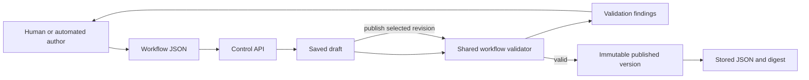
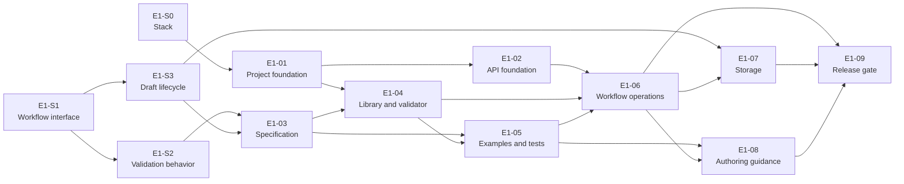

# Epic 01: Shape of a Workflow

Status: Draft for review and decomposition  
Depends on: [High-Level Build Blueprint](../strategy/rostrum-high-level-build-blueprint.md), [Platform Product Plan](../strategy/rostrum-end-to-end-product-plan.md)  
Unlocks: Epic 02, local workflow execution

## Purpose

This Epic defines the first version of Rostrum's workflow interface and builds the first path for saving, validating, publishing, and retrieving a workflow.

It is complete when a human or automated author can save incomplete workflow JSON as a draft through the Control API, retrieve and revise it from validation findings, publish a valid draft, and retrieve the immutable published version with its digest.

## Why this comes first

Every later part of Rostrum depends on a shared understanding of a workflow:

- authors need to save work before a complex workflow is ready to publish;
- the daemon needs a defined graph to execute;
- the Control API and future clients need to agree on what authors can create;
- new step types need a consistent way to add configuration and validation rules;
- published workflows need stable versions that can be retrieved and verified;
- simulation, comparison, and collaboration need stable draft, step, and workflow IDs.

This is also Rostrum's first implementation Epic. It establishes the project structure, shared workflow library, standalone Control API, persistence, automated tests, and continuous integration that later Epics will extend.

## Product state this Epic unlocks

Rostrum will have a small, versioned workflow interface and a draft-to-publication path through the Control API.

The Control API starts as its own process. Epic 02 adds the daemon as a separate process and uses the workflow contract established here.

## What we are building

| Capability | What will exist at the end of the Epic | Why it is needed |
| --- | --- | --- |
| Project foundation | A repository structure with build commands, tests, linting, continuous integration, and clear packages or modules for shared code and services | Gives later Epics a consistent place to add product code |
| Workflow interface v1 | A documented starting shape for workflow JSON, including examples and an interface-version field | Gives authors and Rostrum the same definition of a workflow while allowing the interface to change over time |
| Workflow drafts | Persistent drafts that can be saved, retrieved, revised, and validated before publication | Lets authors build advanced workflows incrementally instead of producing a complete definition upfront |
| Workflow validation | One validator that checks the JSON structure, steps, connections, branches, inputs, outputs, and supported interface version | Gives draft authors specific problems to fix and prevents invalid drafts from being published |
| Control API | A standalone service that manages drafts, validation, publication, and retrieval | Establishes the first product service and the boundary future clients will use |
| Published workflow versions | Persistent, immutable workflow versions with reproducible digests | Lets a caller identify and retrieve the exact workflow that was accepted |
| Examples and authoring guidance | Valid examples, focused incomplete and invalid examples, and instructions tested against the implemented validator | Shows authors how to build and repair workflows without relying on undocumented behavior |

## Workflow interface v1 is a starting point

The first workflow interface should be small enough to implement and test before local execution begins. Version 1 needs to describe sequential steps, branches, and terminal results. Later versions can add more control-flow and node capabilities as their Epics define them.

Three kinds of version must remain distinct:

| Version | What it identifies | When it changes |
| --- | --- | --- |
| Workflow interface version | The rules Rostrum uses to read workflow JSON | When Rostrum changes the workflow interface |
| Draft revision | One saved state of a draft | Each time the draft is saved |
| Published workflow version | One accepted definition of a particular workflow | When an author publishes a valid draft |

The interface-version SPIKE will decide the initial compatibility rules. Validation must select its rules from the declared interface version so a future Rostrum release can continue to recognize v1 after newer versions exist.

## How drafts become published workflows

- The Control API saves syntactically valid JSON as a draft even when it fails workflow validation.
- Each successful save creates a draft revision and returns the current validation findings.
- Draft saves use a revision check so an older client cannot silently overwrite newer work.
- An author can retrieve a saved revision, revise it, validate it again, and choose a revision to publish.
- Publication succeeds only when the selected draft revision has no blocking findings.
- Publication copies the selected draft content into a new immutable workflow version with a digest.
- The draft remains available for later revisions after publication.

Drafts use single-editor semantics in this Epic. Later collaborative authoring work can build comments, merging, and simultaneous editing on top of the draft and revision model.

## What a v1 workflow contains

The workflow specification produced by this Epic will choose the final property names. It must give a new engineer a clear answer to each of these questions.

| Question | Information the workflow provides |
| --- | --- |
| What code understands this workflow? | The workflow interface version |
| Which workflow is this? | A stable workflow ID, name, description, and other basic details |
| What information does it accept? | Named inputs and the shape of each value |
| What work does it describe? | Steps with unique IDs, step types, settings, inputs, and outputs |
| Where does work begin and continue? | A starting step and connections to the next steps |
| How does it choose a path? | Branches whose outcomes lead to named next steps |
| How does information move? | References that pass workflow inputs and earlier step outputs into later steps |
| How does it finish? | Terminal results and the workflow outputs they produce |

Unknown fields and unsupported step types should produce clear validation errors instead of being ignored.

## How validation works

Validation runs when JSON is submitted for validation, saved as a draft, or selected for publication. Later checks run only when earlier results provide enough reliable information.

| Check | What Rostrum verifies | Example finding |
| --- | --- | --- |
| Read the JSON | The content contains valid JSON and follows the selected duplicate-key rule | The content ends before an object is closed |
| Select the interface rules | Rostrum supports the declared workflow interface version | The workflow declares an unknown interface version |
| Check the document shape | Required fields exist and values have the expected types | A step is missing its ID |
| Check steps and connections | Step IDs are unique, connections point to existing steps, and the starting step is valid | A branch points to a step that does not exist |
| Check paths and endings | Every declared branch is complete and reachable paths can lead to a valid terminal result | One branch has no destination |
| Check information passed between steps | References resolve and required step inputs receive compatible values under the supported v1 rules | A step refers to an output that its source step does not declare |
| Prepare publication | Rostrum can assign and store the published version and digest without ambiguity | The request conflicts with an existing immutable version |

## Validation findings

Draft saves, explicit validation, and publication attempts must return the same underlying findings. Each finding needs:

- a stable code;
- a clear explanation;
- whether it prevents publication;
- the part of the workflow that caused it;
- a line and column when the original JSON provides them;
- related locations when two parts of the workflow conflict;
- structured details that an automated author can use without parsing the explanation.

Findings must appear in a consistent order.

## Delivery work

The work is ordered by dependency. SPIKEs answer decisions that would otherwise become accidental public or architectural commitments. Their results may add or split implementation tasks as the Epic is decomposed.

| ID | Outcome | Depends on |
| --- | --- | --- |
| [E1-S0](../tasks/epic-01/e1-s0-select-implementation-stack.md) | Select the stack, repository structure, and process boundaries. | None |
| [E1-S1](../tasks/epic-01/e1-s1-define-workflow-interface-v1.md) | Define workflow interface v1 and its evolution rules. | None |
| [E1-S2](../tasks/epic-01/e1-s2-define-validation-behavior.md) | Define validation behavior, findings, and test cases. | E1-S1 |
| [E1-S3](../tasks/epic-01/e1-s3-define-draft-publication-lifecycle.md) | Define draft revisions, publication, identity, and digests. | E1-S1 |
| [E1-01](../tasks/epic-01/e1-01-create-project-foundation.md) | Create the buildable, tested project foundation. | E1-S0 |
| [E1-02](../tasks/epic-01/e1-02-build-control-api-foundation.md) | Build the standalone Control API foundation. | E1-01 |
| [E1-03](../tasks/epic-01/e1-03-write-workflow-interface-v1-specification.md) | Publish the workflow specification, JSON Schema, and examples. | E1-S1, E1-S2, E1-S3 |
| [E1-04](../tasks/epic-01/e1-04-implement-workflow-library-and-validator.md) | Implement the shared workflow library and validator. | E1-01, E1-03 |
| [E1-05](../tasks/epic-01/e1-05-build-workflow-example-validation-suite.md) | Build the shared workflow example and validation suite. | E1-03, E1-04 |
| [E1-06](../tasks/epic-01/e1-06-add-control-api-workflow-operations.md) | Add validation, draft, publication, and retrieval operations. | E1-02, E1-04, E1-05 |
| [E1-07](../tasks/epic-01/e1-07-add-workflow-draft-version-storage.md) | Persist draft revisions and immutable workflow versions. | E1-S3, E1-06 |
| [E1-08](../tasks/epic-01/e1-08-publish-workflow-authoring-guidance.md) | Publish tested guidance for human and automated authors. | E1-05, E1-06 |
| [E1-09](../tasks/epic-01/e1-09-add-end-to-end-epic-demonstration.md) | Prove the complete Epic state as a continuous-integration gate. | E1-06, E1-07, E1-08 |

## Delivery sequence

The task table is the source of truth for exact dependencies. E1-S0 and E1-S1 can begin immediately; later work opens as their required decisions and foundations are completed.

## Decisions required before implementation

- E1-S0 must approve the implementation stack, repository structure, shared-library boundary, Control API process boundary, persistence approach, and test approach before E1-01 begins.
- E1-S1 must approve workflow interface v1, identity fields, step extension, graph concepts, and compatibility rules before E1-S2 and E1-S3 begin.
- E1-S2 and E1-S3 must approve validation findings, draft revisions, publication behavior, version identity, and digest rules before E1-03 finalizes the public contract.
- E1-03 must produce an internally consistent specification, JSON Schema, and examples before the validator and example suite become implementation contracts.

## Dependencies and sequencing constraints

- The repository structure must support the Control API and future daemon as separate runnable applications.
- The Control API must use the shared workflow library and validation test suite.
- Workflow interface v1 must be settled before its JSON Schema and validator become public contracts.
- The draft and publication lifecycle must be settled before persistent storage is finalized.
- Authoring guidance must be tested against the implemented API, specification, and examples.

## Exit criteria

Epic 01 is complete when all of the following are true:

### The product foundation exists

- The chosen repository structure, build, test, lint, and continuous-integration workflows are documented and passing.
- The Control API runs as a standalone process with health, version, configuration, logging, documented routing, consistent errors, and integration tests.
- The repository is ready to add the daemon as a separate process in Epic 02.

### Workflow interface v1 is defined

- The specification explains the interface version, workflow details, inputs, steps, connections, branches, data references, and terminal results.
- The JSON Schema and examples cover the complete v1 shape.
- The evolution rules explain how future releases continue to recognize v1.

### Incomplete workflows can be saved and revised

- Syntactically valid JSON can be saved as a draft even when workflow validation reports blocking findings.
- Each save creates a retrievable revision and returns the current findings.
- Revision checks prevent an older draft state from silently overwriting newer work.
- Drafts and their revisions remain available after a Control API restart.

### Validation is consistent and actionable

- The shared validator performs every documented v1 check.
- Every validation rule has a focused example and expected finding.
- Draft saves, explicit validation, and publication return the same findings for the same JSON.
- A draft with blocking findings cannot be published.

### Published workflows have stable versions

- A valid draft revision can be published and retrieved.
- Published versions are immutable and remain available after a Control API restart.
- The stored digest can be reproduced using the documented rules and shared test vectors.
- Editing a draft after publication does not change the published version.

### The end state is demonstrated

- A human can save an incomplete draft, interpret its findings, revise it, publish it, and retrieve the published version through the documented Control API.
- An automated author can complete the same loop using structured validation results.
- The repeatable end-to-end demonstration passes in continuous integration.

Completion of this Epic gives Epic 02 a versioned workflow definition, a shared validator, persistent drafts, immutable published versions, and a standalone Control API on which to build local execution.
