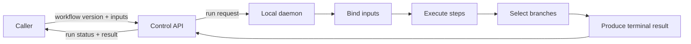
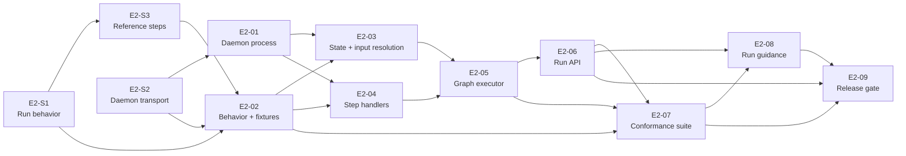

# Epic 02: Local Workflow Execution

Status: Draft for review and decomposition  
Depends on: [Epic 01: Shape of a Workflow](epic-01-shape-of-a-workflow.md)  
Unlocks: Epic 03, durable runs and human control

## Purpose

This Epic adds the first Rostrum daemon and executes published workflows locally through the Control API.

It is complete when a caller can invoke an exact published workflow version with valid structured inputs, receive a run ID, and retrieve a successful result or structured failure after the daemon executes sequential, branching, and terminal control flow.

## Why this comes next

Epic 01 defines what a workflow is. Rostrum must now prove that definition is executable:

- workflow inputs must bind to step inputs;
- step outputs must bind to later steps;
- graph connections must determine execution order;
- branch results must select one declared path;
- terminal results must produce workflow outputs;
- the Control API must remain the caller's execution boundary;
- the daemon must own execution independently of the caller.

This Epic produces the execution rules, daemon, step handlers, graph executor, run API, and tests that later Epics make durable and extend with new capabilities.

## Product state this Epic unlocks

Rostrum will execute a small, side-effect-free workflow in a local daemon.

The Control API accepts and exposes runs. The daemon owns graph execution and must not depend on the caller remaining connected.

## What we are building

| Capability | What exists at the end of the Epic | What it accomplishes |
| --- | --- | --- |
| Executable-workflow specification | One specification and fixture set defining run requests, states, references, handlers, branches, results, and failures | Gives the API, daemon, executor, and tests the same behavior to implement |
| Local daemon | A separately runnable process with configuration, logging, health, version reporting, transport, startup, and shutdown | Provides the process that owns local execution |
| Execution state | In-memory run status, step outcomes, available values, final output, and structured failure | Records what a run knows and produces the inputs for each step |
| Step registry and handlers | One handler interface plus deterministic, side-effect-free reference handlers | Executes a configured step and returns a standard outcome |
| Graph executor | A loop that follows sequential connections, selected branches, and terminal results | Moves a run from its starting step to completion or failure |
| Control API run operations | Operations to start a run and retrieve its status or result | Gives callers one public execution boundary |
| Examples and conformance tests | Shared sequential, branching, success, and failure fixtures run across each execution layer | Detects disagreement between the specification, daemon, and API |

## How a local run works

1. The caller selects an exact published workflow version and supplies structured inputs.
2. The Control API resolves the immutable workflow and sends it with the inputs to the daemon.
3. The daemon validates the invocation, creates a run record, and returns its ID.
4. The runtime binds workflow inputs and starts at the declared first step.
5. Each step receives resolved inputs and returns a typed outcome or structured failure.
6. The runtime records the outcome and follows the declared connection or selected branch.
7. A terminal result binds the workflow outputs and completes the run.
8. The caller retrieves the run status and result through the Control API.

Invalid workflow inputs fail before a step runs. An unsupported step, unresolved binding, invalid branch result, or step failure ends the run with a stable machine-readable failure.

## Runtime boundaries

- The daemon executes only immutable published workflow versions supported by the shared workflow library.
- The first handlers are deterministic and side-effect-free. They prove execution without introducing host commands, containers, models, context access, or integrations.
- One local daemon and in-memory run records are sufficient for this Epic.
- Epic 03 adds durable state, recovery, waits, retries, cancellation, and richer observation.
- Epic 04 adds isolated tools, scripts, and side effects.

## Delivery work

The SPIKEs decide run behavior, daemon transport, and reference steps. E2-02 combines those decisions into the specification and fixtures used by implementation.

| ID | Creates or decides | Depends on |
| --- | --- | --- |
| [E2-S1](../tasks/epic-02/e2-s1-define-local-execution-semantics.md) | Decide how a local run starts, advances, completes, and fails. | Epic 01 |
| [E2-S2](../tasks/epic-02/e2-s2-select-local-daemon-transport.md) | Select the transport and message contract between the Control API and daemon. | Epic 01 |
| [E2-S3](../tasks/epic-02/e2-s3-define-reference-step-set.md) | Select the side-effect-free steps that prove data flow and branching. | E2-S1 |
| [E2-01](../tasks/epic-02/e2-01-build-local-daemon-foundation.md) | Create the separately runnable daemon process and its local transport. | E2-S2 |
| [E2-02](../tasks/epic-02/e2-02-specify-executable-workflow-behavior.md) | Combine the SPIKE decisions into one specification and shared fixture set. | E2-S1, E2-S2, E2-S3 |
| [E2-03](../tasks/epic-02/e2-03-implement-execution-state-and-step-input-resolution.md) | Store run state, resolve step inputs, and record outcomes. | E2-01, E2-02 |
| [E2-04](../tasks/epic-02/e2-04-implement-step-handler-boundary.md) | Create the step registry, handler interface, and reference handlers. | E2-01, E2-02 |
| [E2-05](../tasks/epic-02/e2-05-implement-local-graph-executor.md) | Move a run through sequential, branching, and terminal control flow. | E2-03, E2-04 |
| [E2-06](../tasks/epic-02/e2-06-add-control-api-run-operations.md) | Expose run invocation and status retrieval through the Control API. | E2-05 |
| [E2-07](../tasks/epic-02/e2-07-build-local-execution-conformance-suite.md) | Run the shared fixtures against the runtime, daemon transport, and API. | E2-02, E2-05, E2-06 |
| [E2-08](../tasks/epic-02/e2-08-publish-local-run-guidance.md) | Create tested instructions for running and diagnosing workflows locally. | E2-06, E2-07 |
| [E2-09](../tasks/epic-02/e2-09-add-end-to-end-epic-demonstration.md) | Create one continuous-integration proof of the complete Epic state. | E2-06, E2-07, E2-08 |

## Delivery sequence

E2-S1 and E2-S2 can begin when Epic 01's workflow and service contracts are stable. The task table is the source of truth for exact dependencies.

## Decisions required before implementation

- E2-S1 must settle externally visible run states, readiness, binding, branching, completion, and failure behavior.
- E2-S2 must select the local transport and settle message correlation, health, timeouts, and unavailable-daemon behavior.
- E2-S3 must select the smallest deterministic step set that proves data flow and branching without arbitrary code execution.
- E2-02 must record those decisions in one specification and fixture set before runtime implementation begins.

## Dependencies and sequencing constraints

- Epic 01 must provide published workflow retrieval, validation, immutable versions, and shared examples.
- The Control API and daemon remain independently runnable processes.
- The daemon and Control API use the shared workflow types and validation rules.
- Run APIs expose daemon-owned execution; they do not execute graphs inside the Control API.
- The same fixtures test the execution library, daemon boundary, and Control API.

## Exit criteria

Epic 02 is complete when all of the following are true:

### The daemon executes workflows

- The daemon starts, stops, reports health, and runs separately from the Control API.
- It executes supported published workflow versions through the shared runtime.
- A caller can disconnect after invocation without stopping the run.

### Data and control flow are correct

- Workflow inputs are validated and bound before execution.
- Step outputs resolve into downstream inputs.
- Sequential connections execute in order.
- Each branch follows only its selected destination.
- A terminal result produces the declared workflow output.

### Runs have one API contract

- A caller starts a run with an exact workflow version and structured inputs.
- The start operation returns a stable run ID.
- The caller retrieves current status, final output, or structured failure through the Control API.
- Invalid inputs and unavailable execution services produce documented errors.

### Failures are explicit

- Unsupported steps, unresolved bindings, invalid branch results, and handler failures cannot report success.
- Failures identify the run, step when applicable, stable code, and actionable details.
- A failed run does not execute later steps.

### The end state is demonstrated

- One sequential workflow binds inputs across multiple steps and returns the expected output.
- One branching workflow proves both declared paths in separate runs.
- One invalid invocation and one step failure return the expected structured errors.
- The repeatable end-to-end demonstration passes in continuous integration.

Completion gives Epic 03 a working daemon, execution state, graph executor, handler registry, run API, and test suite to make durable and controllable.
