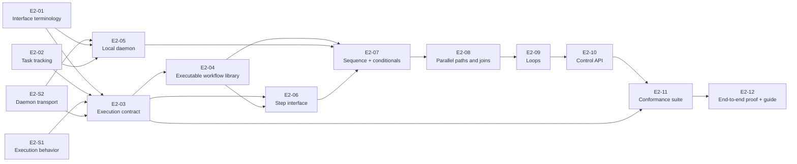

# Epic 02: Local workflow execution

Status: Draft for review and decomposition
Depends on: [Epic 01: Shape of a workflow](epic-01-shape-of-a-workflow.md)
Unlocks: Epic 03, durable runs and human control

## Purpose

This epic turns workflow interface v1 into a complete local execution contract. A caller starts an exact published workflow version through the Control API, the service interface for starting and inspecting workflow runs. The caller can disconnect and later retrieve the run's progress, result, or failures after the local daemon, a background service that runs independently of the client, executes the workflow.

Epic 02 is complete when the daemon executes every workflow interface v1 control-flow construct with registered step types. These constructs include sequences, conditionals, parallel paths, joins (points where parallel paths synchronize), loops with a fixed limit, and explicit results. Epic 02 also tightens the shared workflow contract so that every workflow accepted for execution has one unambiguous runtime meaning.

## Product outcome

At the end of this Epic, a caller can:

1. Start an exact published workflow version with structured inputs.
2. Disconnect without stopping the run.
3. Let the daemon execute the workflow independently.
4. Inspect which step instances are waiting or running.
5. Retrieve either the declared workflow result or the complete ordered list of failures.

The same workflow and step-handler outputs produce the same branch selection, data bindings, loop results, final output, and ordered failures. A step handler is an execution component that runs the logic for a specific step type. Available worker capacity can change when parallel step handlers start, but it cannot change the workflow result.

## Scope

Epic 02 delivers:

- cleanup of unclear workflow-interface terminology and task-tracking references before new execution work begins;
- one reviewed specification and fixture catalog for complete local execution, where a fixture is a predefined workflow definition or input used to check expected execution behavior;
- shared workflow schemas and validation that accept only executable workflow interface v1 documents;
- a separately runnable local daemon;
- a step-handler interface and a small set of deterministic reference steps without side effects, which are step implementations used as baseline building blocks;
- in-memory execution for sequential flow, conditionals, parallel paths, joins, and loops with a fixed limit;
- Control API operations to start and inspect runs;
- one conformance suite, a shared set of checks against the same expected behavior, for the runtime, daemon transport, and Control API;
- one command that proves the complete Epic through the actual process boundary.

## Boundaries

Epic 02 keeps run state in memory and uses bounded reference steps. It does not add:

- database persistence or restart recovery;
- retries or durable attempts;
- waits, pauses, cancellation, or human decisions;
- scripts, tools, model calls, integrations, or other side effects;
- deployment or production readiness.

Epic 03 adds durable runs and human control. Epic 04 adds isolated tools, scripts, and side effects. Later epics build the deployment and product surfaces that culminate in Epic 13.

## Execution rules

The [E2-S1 local execution decision](../decisions/epic-02/e2-s1-local-execution-semantics.md) defines these rules:

- Each run request names one exact immutable published workflow version.
- The daemon rejects missing or undeclared workflow inputs and unavailable handlers before it creates a run.
- Every required step input resolves before its handler starts.
- Every successful handler returns an explicit output object that matches its exact output schema.
- The daemon evaluates conditionals and selects one declared destination.
- Every parallel split reaches one matching join before execution continues or completes.
- Loop iterations run one at a time in collection order and produce ordered result entries.
- A workflow succeeds only at an explicit `result` step.
- The Control API exposes waiting and running step instances through `currentSteps`.
- An unhandled failure stops new handlers from starting. Handlers already running finish, and the run returns every observed failure in stable order.

## Delivery work

The two cleanup tasks are prerequisites for the new contract and implementation work. E2-S1 and E2-S2 can proceed independently of that cleanup.

| ID | Creates or decides | Depends on |
| --- | --- | --- |
| [E2-S1](../tasks/epic-02/e2-s1-define-local-execution-semantics.md) | Decide how a local run starts, advances, completes, and fails. | Epic 01 |
| [E2-S2](../tasks/epic-02/e2-s2-select-local-daemon-transport.md) | Select the transport, the communication mechanism between the Control API and the local daemon. | Epic 01 |
| [E2-01](../tasks/epic-02/e2-01-clarify-workflow-interface-terminology.md) | Replace unclear rule-set terminology and decide whether the current version-selection abstraction is justified. | None |
| [E2-02](../tasks/epic-02/e2-02-establish-task-tracking.md) | Choose the future task-tracking system and remove planning-task references from code. | None |
| [E2-03](../tasks/epic-02/e2-03-define-executable-workflow-contract.md) | Define the complete executable workflow contract and shared fixtures. | E2-S1, E2-S2, E2-01, E2-02 |
| [E2-04](../tasks/epic-02/e2-04-make-workflow-interface-v1-executable.md) | Make the shared workflow library enforce the executable contract. | E2-03 |
| [E2-05](../tasks/epic-02/e2-05-build-local-daemon.md) | Create the separately runnable daemon and its transport boundary. | E2-S2, E2-01, E2-02 |
| [E2-06](../tasks/epic-02/e2-06-build-step-interface-and-reference-steps.md) | Create the handler interface, registry contracts, and reference steps. | E2-03, E2-04 |
| [E2-07](../tasks/epic-02/e2-07-execute-sequential-and-conditional-workflows.md) | Execute sequential workflows and conditional paths in the daemon. | E2-04, E2-05, E2-06 |
| [E2-08](../tasks/epic-02/e2-08-execute-parallel-paths-and-joins.md) | Execute bounded parallel paths, joins, and wait for concurrently running handlers to finish after a failure, retaining any failures they produce. | E2-07 |
| [E2-09](../tasks/epic-02/e2-09-execute-bounded-loops.md) | Execute loops with a fixed limit, including stop-on-error and error-tolerant policies. | E2-08 |
| [E2-10](../tasks/epic-02/e2-10-expose-runs-through-control-api.md) | Expose run requests and inspection through the Control API. | E2-09 |
| [E2-11](../tasks/epic-02/e2-11-build-execution-conformance-suite.md) | Run the shared fixtures against the runtime, daemon transport, and Control API. | E2-03, E2-10 |
| [E2-12](../tasks/epic-02/e2-12-prove-local-execution-end-to-end.md) | Prove the complete Epic through the actual processes and publish the tested local-run guide. | E2-11 |

## Delivery sequence

## Exit criteria

Epic 02 is complete when all of the following are true.

### Accepted workflows are executable

- The shared workflow library accepts every valid execution fixture and rejects every invalid definition.
- Every selected path reaches an explicit `result` step.
- Conditional priorities are unique and every destination is explicit.
- Every parallel split has one matching join.
- Loop configuration includes a defined error policy and ordered result shape.
- Step declarations match the registered required inputs, optional inputs, configuration, and exact outputs.

### The daemon executes the complete v1 control flow

- Sequential steps pass data in order.
- The daemon, not a handler, evaluates conditionals.
- Parallel paths become eligible together, run within configured capacity, and wait at their matching join.
- Parallel completion order does not change the joined result.
- Loop iterations run in collection order and can contain structured parallel work.
- A workflow succeeds only when its selected explicit result binds successfully.

### Runs have one observable contract

- A valid run request returns a stable run ID without requiring the client connection to remain open.
- Invalid input, an unsupported interface version, an invalid `workflow digest` (the value used to validate the requested workflow's content), or an unavailable handler causes the run request to be rejected without creating a run.
- `currentSteps` reports every waiting and running step instance, including loop iteration identity where applicable.
- A succeeded run returns its declared output.
- A failed run returns every observed failure in stable order.

### Failures cannot become success

- Binding, handler, routing, output-validation, loop, and scheduler failures use stable structured codes.
- The first unhandled failure prevents new handlers from starting.
- Handlers already running finish, and any additional failures they produce are retained.
- No later result or successful handler can change a failed run into a successful run.

### The result is proven through the real boundary

- The same fixture catalog passes against the runtime, daemon transport, and Control API.
- One command starts the Control API and daemon as separate processes and exercises every workflow interface v1 control-flow construct.
- The demonstration proves that a run continues after its client disconnects.
- The tested local-run guide explains how to start, inspect, and diagnose the demonstrated workflows.
