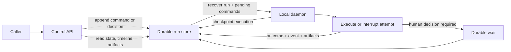
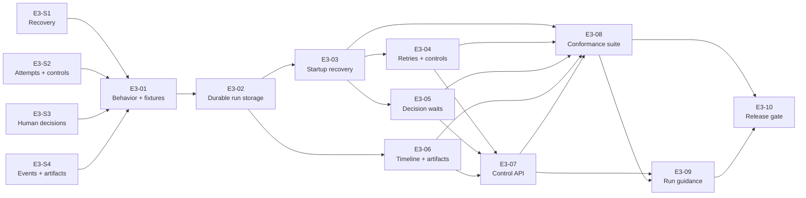

# Epic 03: Durable Runs and Human Control

Status: Draft for review and decomposition  
Depends on: [Epic 02: Local Workflow Execution](epic-02-local-workflow-execution.md)  
Unlocks: Epic 04, Docker tools and scripts

## Purpose

This Epic makes local runs durable, inspectable, retryable, and controllable without requiring the daemon or a client connection to remain continuously available.

It is complete when a run can recover after a daemon restart, expose its committed timeline and artifacts through the Control API, retry a bounded failure, pause at a recoverable point on operator request, wait for a general human decision, resume from that decision, and cancel without starting more work.

## Why this comes next

Epic 02 proves that the daemon can execute a published workflow, but its run record exists only in memory. Rostrum must preserve that execution before later Epics introduce long-running tools, scripts, models, and integrations:

- accepted work must not disappear when the daemon stops;
- recovery must distinguish committed progress from an interrupted attempt;
- a caller must be able to reconnect and inspect the same run;
- transient failures need bounded, visible attempts rather than an unrecorded loop;
- a workflow must be able to wait for a person without occupying active execution;
- an operator must be able to pause or cancel work through durable commands;
- events and artifacts must remain available independently of a client session.

This Epic produces the durable execution contract that later runtimes use when their work has side effects or may last for hours or days.

## Product state this Epic unlocks

Rostrum will preserve and control one local run across daemon and client interruptions.

The daemon remains the only component that advances execution state. The Control API translates committed records into the public contract and appends durable commands and decisions; it does not execute a graph or apply an execution-state transition.

## What we are building

| Capability | What exists at the end of the Epic | What it accomplishes |
| --- | --- | --- |
| Durable run record | Persistent run inputs, graph position, step attempts, outcomes, commands, decisions, and terminal results | Preserves accepted work and committed progress across process restarts |
| Checkpoints and recovery | Transactional checkpoints plus startup recovery for nonterminal runs and interrupted attempts | Continues a run from its last recoverable state |
| Attempt and retry behavior | Distinct attempt records, retryable failure classification, limits, and durable retry scheduling | Makes retries bounded, inspectable, and recoverable |
| Operator controls | Durable pause, resume, and cancellation commands with defined conflicts and acknowledgement | Lets a caller control execution without mutating run state directly |
| Human-decision wait | A general decision step with declared outcomes and an optional structured response | Lets a workflow wait without keeping an active handler or client connected |
| Run timeline | Ordered, immutable run events retrievable after a cursor | Lets a reconnecting client reconstruct what changed without live delivery |
| Run artifacts | Immutable artifact content and metadata with identity, producer, media type, size, and digest | Makes evidence retrievable independently of the event timeline or final result |
| Durable Control API operations | Inspection, event, artifact, command, and decision operations over the shared records | Keeps the Control API useful while the daemon restarts |
| Recovery and control fixtures | Shared restart, retry, wait, pause, cancellation, timeline, and artifact examples | Proves every layer implements the same durable behavior |

## How durable execution works

1. The daemon creates and commits a durable run record before the invocation is acknowledged as accepted.
2. Each execution transition commits the updated run projection, attempt information, and corresponding event together.
3. A step outcome becomes available to later steps only after its checkpoint commits.
4. If the daemon stops during an attempt, startup recovery records that attempt as interrupted and determines the next action from the approved recovery rules.
5. The daemon reads pending control commands before scheduling recovered work.
6. A retry creates a new attempt; it does not overwrite the failed or interrupted attempt.
7. A human-decision step commits its request and enters a durable wait without retaining an active handler.
8. The Control API can inspect committed records while the daemon is unavailable.

Epic 3 does not promise exactly-once handler execution. If a handler finishes but its outcome is not committed before interruption, recovery may start a new attempt. The handlers in this Epic remain deterministic and side-effect-free. Epic 04 must define idempotency and delivery guarantees before side-effecting work relies on this recovery model.

## Execution and Control API ownership

The Control API and daemon use one shared persistence contract with distinct write responsibilities.

| Operation | Owner | Required behavior |
| --- | --- | --- |
| Advance graph or attempt state | Daemon | Commit through the durable execution-state implementation |
| Record checkpoints and execution events | Daemon | Write the state change and its event atomically |
| Read run state, attempts, decisions, events, and artifact metadata | Control API | Translate committed records without inferring new execution state |
| Append pause, resume, or cancellation intent | Control API | Persist an ordered, idempotent command for daemon processing |
| Submit a human decision | Control API | Persist one validated response or return the documented conflict |
| Apply a command or decision to execution | Daemon | Validate current state and commit the resulting transition and event |

The Control API is read-only with respect to execution state. Appending a command records caller intent; it does not mean the requested transition has completed.

## How operator control works

A workflow wait and an operator pause are different conditions:

- A workflow waiting for a human decision resumes only when an accepted decision selects its continuation.
- An operator pause requests that ordinary execution stop as soon as the active attempt can reach a recoverable interruption point.
- An operator resume applies only to an operator-paused run. It does not answer a human-decision request.
- Cancellation prevents further attempts or steps and moves the run to its documented terminal state after active work reaches the cancellation boundary.

When pause is requested during an active handler, the daemon signals the handler through the interruption contract. The handler stops at its next safe point, the current attempt is recorded as interrupted, and the daemon commits the paused state. Resume starts a new attempt for that step unless a future handler contract explicitly provides a resumable checkpoint.

Epic 3 does not forcibly suspend arbitrary in-process code at an unknown instruction. Docker process termination and side-effect handling belong to Epic 04.

## How a workflow waits for a decision

The human-decision step is general enough to represent approval, rejection, selection, correction, or structured input. Its specification defines:

- a stable decision-request ID and the run and step that created it;
- the declared outcomes available to the caller;
- an optional schema for the response payload;
- the information a person needs to make the decision;
- how an accepted outcome selects the next connection and exposes response data;
- the result of duplicate, late, invalid, or conflicting submissions.

The first implementation does not assign approvers or evaluate authorization policy. It records the authenticated caller identity when one exists, but users, teams, approver groups, notifications, and governance policy remain later work.

## How retries work

- Retry behavior is configured explicitly and bounded by a maximum attempt count.
- Only failures classified as retryable by the approved contract receive another attempt.
- Every attempt has its own identity, number, timestamps, outcome, and related events.
- A retry remains durable if the daemon restarts before the next attempt begins.
- Exhaustion produces a stable terminal failure that retains every attempt.
- A pause or cancellation command takes precedence before another retry attempt is scheduled.

The fixture set may use a deterministic handler whose outcome depends on its attempt number. General workflow loops, time budgets, token budgets, and financial budgets are not required to prove retry behavior.

## Run timelines and artifacts

Every committed run event receives a monotonically increasing sequence within its run. The Control API returns stable pages after an opaque cursor. A caller can disconnect, retain its last cursor, and retrieve the later events after reconnecting. Live event delivery is not part of this Epic.

An artifact is immutable content with independently retrievable metadata. Each artifact identifies its run, producing step and attempt when applicable, name, media type, byte size, digest, creation time, and storage reference. Events and step outcomes refer to artifact IDs rather than embedding artifact bodies.

The artifact implementation is local and self-hostable. Retention policies, deletion workflows, remote object stores, external-context retention, and cloud tenancy are not part of this Epic.

## Runtime boundaries

- One local daemon owns execution and recovery. Multiple daemons, distributed claims, leases, leader election, and failover are later work.
- The Control API may remain available while the daemon restarts, but it does not advance execution state.
- The supported handlers remain deterministic and side-effect-free.
- Durable waits are limited to human decisions. Retry readiness may be represented durably without adding a general timer node.
- Parallel branches, joins, child workflows, and general cycles are not introduced by this Epic.
- Live event subscriptions, notifications, identity policy, and artifact retention policy remain later work.

## Delivery work

The SPIKEs decide recovery, attempts and controls, human decisions, and observation records. E3-01 combines those decisions into one durable-execution specification and fixture set.

| ID | Creates or decides | Depends on |
| --- | --- | --- |
| [E3-S1](../tasks/epic-03/e3-s1-define-checkpoint-and-recovery-semantics.md) | Decide what commits atomically and how a single daemon recovers nonterminal runs. | Epic 02 |
| [E3-S2](../tasks/epic-03/e3-s2-define-attempt-retry-and-control-semantics.md) | Decide how attempts, bounded retries, interruption, pause, resume, and cancellation behave. | Epic 02 |
| [E3-S3](../tasks/epic-03/e3-s3-define-human-decision-waits.md) | Define general human-decision requests, submissions, conflicts, and continuation. | Epic 02 |
| [E3-S4](../tasks/epic-03/e3-s4-define-run-events-and-artifacts.md) | Define event ordering and replay plus artifact identity, metadata, integrity, and retrieval. | Epic 02 |
| [E3-01](../tasks/epic-03/e3-01-specify-durable-execution-behavior.md) | Combine the SPIKE decisions into one specification and shared fixture set. | E3-S1, E3-S2, E3-S3, E3-S4 |
| [E3-02](../tasks/epic-03/e3-02-implement-durable-run-storage.md) | Persist runs, checkpoints, attempts, commands, decisions, and terminal outcomes. | E3-01 |
| [E3-03](../tasks/epic-03/e3-03-recover-interrupted-runs.md) | Recover nonterminal runs and interrupted attempts when the daemon starts. | E3-02 |
| [E3-04](../tasks/epic-03/e3-04-implement-retries-and-operator-controls.md) | Execute bounded retries and apply cooperative pause, resume, and cancellation. | E3-02, E3-03 |
| [E3-05](../tasks/epic-03/e3-05-implement-human-decision-waits.md) | Execute a general decision step through a durable wait and accepted response. | E3-02, E3-03 |
| [E3-06](../tasks/epic-03/e3-06-add-run-timelines-and-artifacts.md) | Persist ordered run events and immutable artifacts with cursor-based retrieval. | E3-02 |
| [E3-07](../tasks/epic-03/e3-07-add-durable-run-control-api-operations.md) | Expose durable inspection, commands, decisions, timelines, and artifacts through the Control API. | E3-04, E3-05, E3-06 |
| [E3-08](../tasks/epic-03/e3-08-build-durable-execution-conformance-suite.md) | Run recovery and control fixtures across the runtime, daemon, store, and API. | E3-03, E3-04, E3-05, E3-06, E3-07 |
| [E3-09](../tasks/epic-03/e3-09-publish-durable-run-guidance.md) | Create tested instructions for recovering, inspecting, and controlling local runs. | E3-07, E3-08 |
| [E3-10](../tasks/epic-03/e3-10-add-end-to-end-epic-demonstration.md) | Create one continuous-integration proof of the complete durable run lifecycle. | E3-08, E3-09 |

## Delivery sequence

The four SPIKEs can begin when Epic 02's execution and handler contracts are stable. The task table is the source of truth for exact dependencies.

## Decisions required before implementation

- E3-S1 must settle checkpoint boundaries, atomic records, invocation acknowledgement, interrupted-attempt handling, recovery ordering, and the shared-store ownership model.
- E3-S2 must settle retry classification and limits, interruption points, command ordering, idempotency, precedence, and terminal cancellation behavior.
- E3-S3 must settle decision configuration, response schema, wait state, branch selection, and duplicate or conflicting submissions.
- E3-S4 must settle event sequences and cursors plus artifact metadata, storage, integrity, and retrieval behavior.
- E3-01 must combine these decisions into compatible state transitions and fixtures before the durable store becomes an implementation contract.

## Dependencies and sequencing constraints

- Epic 02 must provide stable invocation, run-state, graph-execution, handler, and daemon-transport contracts.
- The durable store extends the database or equivalent persistence foundation selected by Epic 01.
- A run invocation cannot report durable acceptance before its initial run record commits.
- The daemon must process pending commands before scheduling recovered work.
- Execution-state changes and their events must not disagree after a committed transaction.
- The Control API may append commands and decisions but cannot write an execution-state projection.
- Recovery, API, and runtime tests use the same approved fixtures and failure codes.

## Risks to resolve

- A poorly chosen checkpoint boundary can duplicate work or lose an accepted outcome after interruption.
- Command and execution races can start work after a durable pause or cancellation request unless ordering and precedence are explicit.
- Treating an API command response as a completed transition can mislead clients during daemon downtime.
- Artifact writes and metadata commits can disagree unless incomplete content and integrity failures have defined handling.
- Schema coupling between the daemon and Control API can create two interpretations of a run unless both use the same persistence contract.

## Exit criteria

Epic 03 is complete when all of the following are true:

### Runs survive interruption

- An accepted run and every committed transition remain available after the daemon stops.
- Startup recovery finds each nonterminal run and handles interrupted attempts according to the specification.
- Recovery never treats an uncommitted handler outcome as completed work.
- Pending pause or cancellation commands are considered before recovered work starts.

### Attempts and retries are explicit

- Each handler invocation has a distinct attempt record and related events.
- A retryable fixture fails, retries within its configured limit, and then succeeds.
- A retry-exhaustion fixture preserves every attempt and produces the documented terminal failure.
- A daemon restart between attempts does not lose or exceed the retry plan.

### Human and operator control are durable

- A human-decision step waits without an active handler or connected client.
- One valid general decision selects the documented continuation and makes its response available downstream.
- Duplicate, invalid, late, and conflicting decisions return documented results.
- An operator pause interrupts an active reference handler at a recoverable point and commits the paused state.
- Resume starts the documented new attempt, and cancellation prevents later work.

### Runs can be inspected without an active daemon

- The Control API returns the last committed run projection while the daemon is unavailable.
- Events are ordered, immutable, and retrievable after an opaque cursor without gaps or duplicates.
- Attempts, controls, decision requests, and decision results are visible through the documented contract.
- Artifact metadata and content remain retrievable and pass digest verification.
- The Control API never advances execution state.

### The end state is demonstrated

- One run is interrupted during an active attempt, recovered after daemon restart, and completed without losing committed progress.
- One run retries a bounded failure and exposes every attempt in its timeline.
- One run waits across daemon and client interruption, accepts a human decision, produces an artifact, and completes through the selected path.
- One active run is paused at a recoverable point, resumed, and later canceled before another step begins.
- The repeatable end-to-end demonstration passes in continuous integration.

Completion gives Epic 04 a durable run store, attempt model, interruption contract, controls, event timeline, and artifact boundary on which to add side-effecting Docker tools and scripts.
