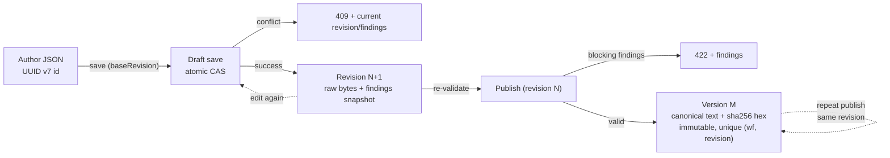

# E1-S3 research: draft → published-version lifecycle options

**Temporary research doc** — feeds the E1-S3 decision record (`docs/decisions/epic-01/e1-s3-...`). Not a decision. Status: research, 2026-08-16.

## Scope

E1-S3 must answer:

1. Which workflow, draft, revision, and published-version identifiers exist?
2. When does each identifier change?
3. How is incomplete JSON saved, retrieved, and revised safely?
4. How does an author select a revision for publication?
5. What happens on repeated publication or a version conflict?
6. How is published JSON normalized and hashed?
7. What happens to a draft after publication?

## Constraints from prior decisions (assumed fixed)

| Source | Constraint |
| --- | --- |
| E1-S0 | Postgres + Kysely + postgres.js; transactional revision checks and publication atomicity are **designed by E1-S3**, implemented by E1-07. |
| E1-S1 | Authored JSON carries **no lifecycle fields** (`createdAt`, revision, version, digest are server-managed). All document-internal identifiers are UUID v7. `id` is required in the authored document. `interfaceVersion` is exact-match. |
| Epic-01 | Drafts save **syntactically valid JSON even with blocking findings**; single-editor semantics in Epic 1; "editing a draft after publication leaves the published version unchanged"; published versions immutable. |
| E1-02/E1-06 | E1-06 wording: "Saving from an outdated revision fails with a documented conflict"; "Publishing reruns validation and rejects a selected revision with blocking findings"; "A successful publish returns the workflow ID, published version, interface version, and digest." |
| E1-07 | Drafts, revisions, findings, published versions persisted; "Draft retrieval returns the selected revision unchanged"; published versions cannot be changed/deleted through draft operations. |
| E1-S2 | Finds what a finding is and which findings block publication; a duplicate-key rule is selected there but **the digest rules in E1-S3 constrain that choice** (see §6). |

Note on E1-S1's "all identifiers are UUID v7": that statement covers the authored document shape. E1-S1 explicitly deferred "creation time, revision, published-version identity, and digest" to E1-S3, so server-managed lifecycle identifiers (revision number, version number) may legitimately be integers.

---

## 1. Which identifiers exist

### 1a. Workflow identity

Fixed by E1-S1: the `id` (UUID v7) inside the authored JSON, unique within a workspace. Open question: **who assigns it?**

| Option | Pros | Cons |
| --- | --- | --- |
| **A. Author supplies it** (server validates format and consistency) | No special "create" flow — every save is a save of a self-identifying document; automated authors can mint UUID v7 offline and reference steps before first save; aligns with E1-S1's `id` being required in the document | Server must reject id-format errors and id mismatches; a wrong id in the document would otherwise write to the wrong workflow — so mismatch must be a hard error, not a draft finding |
| **B. Server assigns on first save** | Single source of identity; no client-side UUID generation for the workflow | Two-step create-then-save flow; contradicts `id` being **required** in the authored shape (the first submitted document cannot carry it); the validate-only operation (E1-06) still needs an id to validate against — awkward |
| **C. Separate draft id vs workflow id** | Enables multiple concurrent drafts of one workflow (future collaboration) | Adds a mapping table and dual-identity confusion; Epic 1 is explicitly single-editor, one draft per workflow. Defer to the collaboration epic |

**Recommendation: A.** Author-supplied UUID v7, validated for format on every save; an embedded `id` that differs from the identity the API addressed is a **409 identity conflict** (see §3), never silently accepted.

### 1b. Draft identity

The draft **is** the workflow's working copy, identified by the workflow `id`. One draft per workflow in Epic 1; revisions hang off it. No separate draft identifier is exposed. (Internal storage may use the workflow `id` as PK or a surrogate — implementation detail for E1-07, not a contract.)

### 1c. Revision identifier

| Option | Pros | Cons |
| --- | --- | --- |
| **A. Per-workflow monotonic integer (1, 2, 3, …)** | Human-addressable ("revision 4"); trivially ordered; the `baseRevision` conflict check is a plain integer comparison; natural composite key `(workflow_id, revision)` | Needs transactional increment/sequence per workflow; not globally unique (composite with workflow id) |
| **B. UUID v7 per revision** | Globally unique; time-ordered; matches the "UUID v7 everywhere" aesthetic | Opaque to humans; ordering needs a timestamp anyway; `baseRevision` comparison becomes UUID equality against a "current" pointer — no simpler than an integer, harder to debug |
| **C. Integer + internal UUID row key** | Both addressability and global uniqueness | Two identifiers for one concept; YAGNI — the integer is the contract |

**Recommendation: A.** Integer revision number per workflow. The revision number is the API-facing contract (`baseRevision`, publish selection); integers make "which is newer" and "did it conflict" trivial. E1-S1's UUID rule applies to the authored document, not to server-managed lifecycle state.

### 1d. Published-version identifier

| Option | Pros | Cons |
| --- | --- | --- |
| **A. Per-workflow monotonic integer (v1, v2, …)** | Matches E1-S1's phrase "published-version number"; callers address `version 2 of workflow X`; ordering obvious; short in URLs (`/workflows/:id/versions/2`); matches execution-request mental model ("run v3") | Only unique per workflow (composite key) |
| **B. UUID v7 per version** | Globally unique | No human ordering; awkward for "run the latest published version" and for conflict messages; loses the "version number" language E1-S1 used |
| **C. Semver (1.0.0)** | Signals breaking changes | No patch/minor semantics exist for workflow definitions; interface compatibility is already handled by `interfaceVersion` (E1-S4); authors should not curate semver; E1-S1 already rejected semver for the interface token — same reasoning applies |
| **D. Content-address (digest as identity)** | Inherent immutability and dedupe | Opaque, non-sequential; identical content republished as a "new version" becomes impossible without disambiguation; conflates identity with verification. Digest is stored as an attribute (§6), not the identity |

**Recommendation: A.** Integer version number per workflow, unique per `(workflow_id, version_number)`.

### 1e. Identifier summary (recommended model)

| Identifier | Type | Assigned by | Scope |
| --- | --- | --- | --- |
| Workflow `id` | UUID v7 | Author (validated by server) | Workspace |
| Draft | = workflow `id` | — | One per workflow (Epic 1) |
| Revision | integer ≥ 1 | Server, per successful save | Per workflow |
| Published version | integer ≥ 1 | Server, per successful publish | Per workflow |
| Digest | hex string | Server, at publish | Content-scoped |

---

## 2. When does each identifier change

| Identifier | Changes when | Never changes when |
| --- | --- | --- |
| Workflow `id` | First save (it is authored) | Later saves, publish, edits |
| Revision | +1 per **successful save**, in commit order (transactional) | A failed save, a rejected (conflict) save — nothing is assigned on failure |
| Published version | +1 per successful publish (of a not-yet-published revision under model 5a; per publish event under 5b) | Failed/rejected publishes (blocking findings, conflicts) |
| Digest | Recomputed at publish from the selected revision's content; identical content ⇒ identical digest | The stored digest of an existing published version — immutable with the version |
| Timestamps | Server/DB clock at save and publish (`timestamptz`) | — |
| `interfaceVersion` | Only by the author editing the document | It selects the frozen rule set used for validation and digest semantics |

Not identifiers, but lifecycle data the model must fix (E1-07 schemas): **findings are recomputed and snapshotted per revision**; publish re-runs validation on the stored revision content (E1-06 contract) and must yield no blocking findings.

---

## 3. Safe save / retrieve / revise

### 3a. Concurrency control (revision check)

| Option | Pros | Cons |
| --- | --- | --- |
| **A. Optimistic: required `baseRevision`** — save carries the revision the client last saw; server commits only if it equals the current latest; otherwise **409** + current revision/findings | Stateless client; retry-friendly for automated authors; standard; directly matches E1-06 "Saving from an outdated revision fails with a documented conflict"; implementable as one atomic statement: `UPDATE workflows SET current_revision = current_revision + 1 WHERE id = $1 AND current_revision = $base RETURNING …` (no row ⇒ conflict) | Client must handle 409 (documented retry: re-fetch, merge, resave) |
| **B. Pessimistic lock token / checkout** — draft is "checked out" (`SELECT … FOR UPDATE` for the edit duration); saves require the token | Enforces single-editor semantics server-side | Lock lifetime management (timeouts, abandoned locks, steal semantics); forces statefulness on clients; overkill for Epic 1 |
| **C. Last-write-wins, no check** | Simplest possible | Violates the acceptance criterion "revision checks prevent an older draft state from silently overwriting newer work" — rejected outright |
| **D. HTTP `If-Match`/ETag** — revision exposed as ETag; save requires `If-Match` | Purely standard HTTP; cache-friendly | One more mapping layer; automated authors and SDKs prefer explicit fields. Optional to expose *in addition to* A; the contract field is `baseRevision` |

**Recommendation: A.** Atomic CAS via conditional update inside a transaction; insert the revision row and snapshot findings in the same transaction; unique index `(workflow_id, revision)` as a backstop. Optionally also serve the revision as an ETag for HTTP purity — cosmetic, not required.

### 3b. What may be saved

| Option | Pros | Cons |
| --- | --- | --- |
| **A. Any syntactically valid JSON** (object or not) saves as a draft, with full validation findings (blocking ones included) | Literally satisfies "syntactically valid JSON can be saved as a draft despite blocking workflow findings" — even `[1,2,3]` is a savable draft | Identity extraction: a non-object document has no `id`, so the workflow identity must come from the API path/param; retrieval of such a draft is still well-defined (raw bytes) |
| **B. Only top-level objects save**; anything else is a 400 | Cleaner API; guarantees an `id` is presentable | Narrower than the acceptance criterion; arbitrary cut |

**Recommendation: A.** The identity the API addressed (path `workflowId`) is authoritative. Rule: if the document is an object and embeds an `id`, it **must equal** the addressed workflow id — mismatch is a **400/409 identity conflict**, not a draft finding (it would otherwise be a cross-workflow write). A document lacking an `id` is a blocking *finding* (still saveable). Duplicate keys and non-JSON input are parse errors, not drafts (see §6).

### 3c. Content storage: raw bytes vs canonical

| Option | Pros | Cons |
| --- | --- | --- |
| **A. Store the exact submitted bytes (raw JSON text) for drafts** | E1-07 "returns the selected revision unchanged" is literally true; findings' line/column (E1-S2) point at the text the author actually saved; no re-serialization surprises | Digest must be computed over a canonicalization of the bytes (or over the raw bytes — §6); storage is not normalized |
| **B. Canonicalize (RFC 8785) at save time and store canonical text** | Uniform content; digest trivially verifiable from stored bytes | Author formatting lost; line/column in findings no longer match the stored text; "unchanged" retrieval becomes "same document, different formatting" — contradicts E1-07 wording |
| **C. Store both raw and canonical** | Both byte-fidelity and uniformity | Redundant, sync risk — rejected |

**Recommendation: A for drafts, canonical for published versions.** Drafts store raw bytes (byte-exact retrieval). Publication canonicalizes the selected revision's content once (§6), stores the canonical text as the published version's content, and stores `digest = sha256(canonical_text)`. Retrieving a published version returns the canonical document — that **is** the published version, and verification is byte-for-byte: `sha256(retrieved) == digest`. This gives drafts fidelity and versions determinism without storing anything twice.

---

## 4. Selecting a revision for publication

| Option | Pros | Cons |
| --- | --- | --- |
| **A. Publish by revision number** — `POST /workflows/:id/publish { revision: N }`; server re-validates the stored content of revision N; blocking findings ⇒ 422 with findings (nothing created); otherwise creates the version | Explicit; matches the task wording "an author selects a revision for publication" and E1-06 "publish a selected valid revision"; any saved revision (not just latest) is publishable — important for "I validated revision 3, then made unvalidated edits" flows | None material |
| **B. Publish latest only** (no selection) | Simpler API | Cannot publish an earlier revision; contradicts the task wording — rejected |
| **C. Publish by digest** | Content-addressed selection | Client must compute the digest; opaque; selection by digest is a verification feature, not an authoring affordance — rejected |

Always **re-run validation at publish time** on the stored revision content — never trust save-time findings alone. Revisions are immutable and rule sets are frozen per `interfaceVersion`, so revalidation is deterministic and cheap; it makes "published ⇒ validated" a server-enforced invariant rather than an assumption (and E1-06 already requires it). A nonexistent revision ⇒ 404. Publish reads the revision row inside the same transaction that inserts the version.

**Recommendation: A.**

---

## 5. Repeated publication and version conflicts

### Model 5a: a revision publishes at most once (idempotent repeat)

- Unique index on `(workflow_id, revision)` in `published_versions`.
- Publishing an already-published revision returns the **existing** version (idempotent) instead of creating a duplicate.
- Concurrent publishes of the same revision: the unique index lets one insert win; the loser catches the violation inside its transaction and returns the winner's record. No user-visible 409.
- Version numbers are strictly monotone with revisions; the model is conflict-free by construction.

| Pros | Cons |
| --- | --- |
| No ambiguity; repeated publication has one defined result (same version returned); version history never contains duplicates; retry-safe for automated authors | Re-publishing an *old* revision as a rollback is not a single call — the author must first create a new revision carrying the old content (e.g. a "restore revision N" convenience save, out of E1-S3 scope but trivial in E1-06) |

### Model 5b: each publish creates a new version (revision → 1..N versions)

- Repeated publish of the same revision either (b1) always creates a new version, or (b2) dedupes to the existing one — must be specified, and (b2) is indistinguishable from 5a for the repeat case.
- Concurrent publishes: unique `(workflow_id, version_number)`; loser gets **409 + current version list** (client retries), or auto-assigns the next free number inside a retried transaction.

| Pros | Cons |
| --- | --- |
| Re-publishing an old revision = one-call rollback; version numbers count publish events | Ambiguity must be resolved by fiat; 409 conflicts are observable; duplicate content across versions is possible; "version N" no longer implies "content newer than version N-1" |

**Recommendation: 5a.** Simplest coherent semantics; satisfies every acceptance criterion ("repeated publication and version conflicts have defined results" — the repeat case returns the existing version, and conflicts are structurally impossible for publish, only for concurrent *saves*, which §3a handles). If one-call rollback becomes a product need, add an explicit "new revision from revision N" operation in E1-06 rather than weakening version semantics.

### Version-conflict inventory (recommended model)

| Scenario | Result |
| --- | --- |
| Publish revision with blocking findings | 422 + findings; no version created; draft untouched |
| Publish nonexistent revision | 404 |
| Publish already-published revision | 200, existing version returned (idempotent) |
| Two concurrent publishes of the same revision | Both succeed; both return the same single version (unique index + in-transaction retry) |
| Save with stale `baseRevision` | 409 + current revision/findings (no partial write) |
| Save where embedded `id` ≠ addressed workflow id | 400/409 identity conflict |
| Editing draft after publication | New revision; published versions byte-unchanged (immutable rows) |

---

## 6. Normalization and hashing of published JSON

Purpose: "Shared test vectors reproduce the same published digest across intended implementations" — Bun/TypeScript runtime, the Cloud control plane (reimplementing the same contract, language TBD), and conformance harnesses. The digest must be computable identically everywhere, so the normalization rules must be a public, language-neutral contract.

### 6a. Canonicalization

| Option | Pros | Cons |
| --- | --- | --- |
| **A. RFC 8785 (JCS — JSON Canonicalization Scheme)** | The only *standard* canonical JSON form: member names sorted lexicographically by UTF-16 code units; numbers serialized as shortest IEEE-754 round-trip (ES `Number::toString` — so `1.0`→`1`, `-0`→`0`); strings escaped minimally (`"`, `\`, control chars; `\u0041` and `A` both canonicalize to `A`); no whitespace; rejects NaN/Infinity; **requires duplicate-free input**. Implementations exist for every target language (TS, Python, Go, Java, C, Rust) | A dependency; demands strict input rules (duplicate keys rejected — which the product wants anyway); Unicode normalization is **not** applied (NFC vs NFD bytes hash differently — must be documented as defined behavior); number domain is IEEE-754 doubles (fine — JSON Schema 2020-12 is the double domain) |
| **B. Custom canonicalization (sorted keys + `JSON.stringify`)** | No dependency in TS | Number formatting and string escaping are runtime- and version-dependent (`1e21` vs `1e+21`, `-0`, escape choices, float formatting); cross-implementation reproduction is fragile — this is RFC 8785 reinvented badly. Rejected |
| **C. Digest over the raw submitted bytes (no canonicalization)** | Trivial; byte-exact verification; cross-impl vectors are just byte strings | Identical documents with different whitespace, key order, or formatting hash differently — key order and formatting differ constantly with AI authors and editor round-trips; the digest stops being a content fingerprint; the task wording ("published JSON **normalized** and hashed") implies canonicalization; dedupe and content-equality checks impossible. Acceptable fallback, not recommended |
| **D. Postgres `jsonb` round-trip as the canonical form** | Free with the storage choice | Postgres-specific serialization (ordering, number formatting) — not stable across PG versions, meaningless to other implementations. Anti-pattern for a *public* digest. Rejected |

**Recommendation: A (RFC 8785)**, pinned by exact reference in the decision record, with the E1-S3 digest rules **requiring duplicate-key rejection at parse time** — this constrains the duplicate-key rule E1-S2 selects: last-wins parsing and deterministic digests are incompatible. Flag this dependency to E1-S2 explicitly.

### 6b. Hash algorithm and encoding

| Option | Pros | Cons |
| --- | --- | --- |
| **SHA-256, lowercase hex (64 chars)** | Ubiquitous, FIPS, hardware-accelerated, in every stdlib; hex is the convention (git, Docker); collision resistance far beyond need | 64 chars is longer than base64url |
| **SHA-256, base64url (43 chars)** | Compact | Less conventional for content digests; must pin padding rules |
| SHA-512/256, BLAKE3 | Faster on some hardware | Less universal; no benefit at this security level |

**Recommendation: SHA-256 + lowercase hex.** Pin the exact algorithm and encoding in the decision record so test vectors are unambiguous.

### 6c. Digest scope

| Option | Pros | Cons |
| --- | --- | --- |
| **A. The entire canonical document** (interfaceVersion, id, name, description, inputs, steps, conditionals — everything) | "Exact version retrieved and verified" is literally satisfied; no fiddly exclusion list; name changes are real definition changes | Digest changes when only the name changes |
| **B. Exclude metadata (`name`/`description`)** | Digest tracks execution semantics only | Partial-hash rule is more complex to specify and verify; a caller verifying "the exact version" has to re-hash with exclusions; marginal benefit. Rejected |

**Recommendation: A.** The digest is content identity: identical canonical documents hash identically even across different workflows (the document already contains its own `id`). Server context (version number, timestamps) is never hashed — the digest must be computable from the document alone, which is what makes standalone test vectors possible.

### 6d. Where the digest is computed and stored

- Compute `digest = sha256(hex, RFC8785(document))` at **publish** time (and optionally at save time, stored with the revision, so publish can reuse it — deterministic either way).
- Store the digest on the published-version row; E1-07's "stored-digest verification" = recompute from the stored canonical bytes and compare.
- **Test vectors:** the E1-S1 example documents (sequential, conditional, fan-out/fan-in, loop, grouped) become vector fixtures: canonical text + expected `sha256` hex. Vector digests must be produced by two independent implementations (or cross-checked in E1-05/E1-09) — never generated and trusted from one codebase. Edge-case vectors to include: key-order insensitivity, number edge cases (`1.0`/`1`, `1e2`, integers ≥ 2^53 rounding), string escaping (`\u0041` vs `A`), UTF-8/Unicode (incl. NFC vs NFD producing *different* digests — assert the defined behavior), `-0`, `{}`/`[]`, deep nesting, duplicate keys (parse rejection).

---

## 7. What happens to a draft after publication

| Option | Pros | Cons |
| --- | --- | --- |
| **A. Draft remains open and editable** — further saves create new revisions; further publishes create new versions; published rows are never touched | Matches the epic verbatim ("The draft remains available for later revisions after publication"); iteration/fix workflows are natural; "editing a draft after publication leaves the published version unchanged" is trivially satisfied by immutable version rows | None material |
| **B. Draft becomes read-only after first publish**; further edits require a new draft/branch | "Published = frozen" mental model | Contradicts the epic; heavy for the common fix-and-republish loop. Rejected |
| **C. Draft deleted on publication** | Storage minimalism | Destroys author work; contradicts the epic. Rejected |

**Recommendation: A.** Publication is a *copy* operation (revision content → immutable version), never a move or delete. A revision remains retrievable after publication (it is the source of the version and the `baseRevision` ancestor of later edits).

---

## 8. Recommended model (consolidated — proposal for the decision record)

- **Identifiers:** workflow `id` UUID v7 (author-supplied, immutable); revision = per-workflow integer; version = per-workflow integer; digest = sha256 hex of RFC 8785 canonical form.
- **Save:** any syntactically valid JSON saves as a draft; parse failures (incl. duplicate keys, NaN/Infinity) are 400s, not drafts; revision check via `baseRevision` CAS in one transaction; every successful save creates exactly one revision; findings recomputed and snapshotted per revision.
- **Publish:** select a revision; server re-validates its stored content; blocking findings ⇒ 422; valid ⇒ canonicalize once, store canonical text + digest as an immutable version; unique `(workflow_id, revision)` makes repeats idempotent and conflicts structurally impossible.
- **Draft:** remains editable; published versions never change.

## 9. Cross-spike dependencies and open questions

| Item | Owner | Note |
| --- | --- | --- |
| Duplicate-key rule | E1-S2 (constrained by E1-S3) | Deterministic digests require duplicate-key **rejection** at parse; last-wins is incompatible — decision record must state this dependency |
| `baseRevision` conflict + publish semantics | E1-06/E1-07 implement | Semantics defined here (§3, §5); E1-06 maps to endpoints/error codes (409, 422, 404, idempotent publish) |
| Findings snapshot per revision | E1-07 schema | Store findings JSON with each revision so retrieval returns them without revalidation |
| Max JSON depth/size at parse | E1-02/E1-03 or defaults here | A documented limit keeps parse behavior identical across implementations (stack-depth divergence); propose a default (e.g. depth 512) if not decided elsewhere |
| Timestamp source | E1-S3 record | Server/DB `now()` at save/publish; no client timestamps |
| Draft deletion | Epic 1 scope | Not required by any acceptance criterion; published versions must not be deletable through draft ops (E1-07); draft deletion semantics can be deferred |
| Rollback ergonomics | E1-06 (optional) | Under model 5a, one-call rollback = "new revision from revision N" convenience operation; explicitly *not* re-publishing semantics |
| UUID v7 *within* revisions/versions | rejected | Documented here so the decision record can justify the integer choice against E1-S1's UUID phrasing |

## 10. Acceptance-criteria coverage map

| E1-S3 acceptance criterion | Section |
| --- | --- |
| Reviewed decision record defines each identifier and when it changes | §1, §2 |
| Syntactically valid JSON saves as a draft despite blocking findings | §3b |
| Each save creates a revision; revision check prevents silent overwrites | §1c, §3a |
| Publishing a selected valid revision creates an immutable version without removing the draft | §4, §7 |
| Repeated publication and version conflicts have defined results | §5 |
| Shared test vectors reproduce the same published digest across implementations | §6 |
