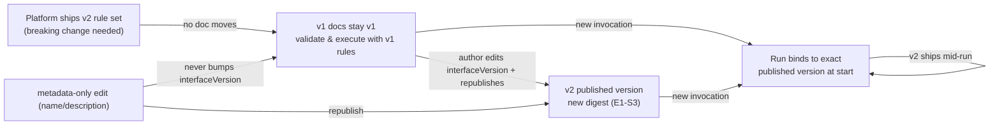

# E1-S4 research: interface versioning methodology and runtime impact options

**Temporary research doc** — feeds the E1-S4 decision record (`docs/decisions/epic-01/e1-s4-...`). Not a decision. Status: research, 2026-08-17.

**Decisions made 2026-08-17** (recorded in the E1-S4 decision record): §1a → **C** (field-classification table, in force from v1); §3c → **B** (deprecation windows from the start); §4a → **B** (metadata excluded from the digest — amends E1-S3). All other sections follow their stated recommendations. The §4a and §6 "A" recommendations below are superseded.

## Scope

E1-S4 must answer:

1. What constitutes an operational change (affecting execution behavior) vs a metadata change (e.g., description, name)?
2. Which change types trigger an interface version bump?
3. How do actively running workflows get impacted when a new interface version is published?
4. How do metadata-only changes interact with versions?
5. How do popular workflow platforms (Zapier, Temporal, n8n, and similar) handle versioning methodology and runtime impact?

The current exact-match token contract for v1 (`"v1"` string, exact match, no fallback to any other version) is **not altered** by this SPIKE. This research determines the methodology for *future* version transitions and the operational impact on running workflows.

## Constraints from prior decisions (assumed fixed)

| Source | Constraint |
| --- | --- |
| E1-S1 | `interfaceVersion` is a top-level exact-match string (`"v1"`), a capability token, not a number or semver. Rostrum retains **one immutable rule set per version** (document schema + step-type registry) and ships every version's rule set forward forever. Unknown version = blocking finding, never fallback. **Additive** change within a version (new optional field, new step type, relaxed validation) is allowed only if every previously valid v1 document stays valid. **Breaking** change requires a new interface version. There is **no automatic upgrade or rewriting**: a v1 document stays v1. A step-type `config` schema change that invalidates a previously valid `config` is an interface change (bump or new type name); adding a step type is backward- and forward-compatible. |
| E1-S3 | Published versions are per-workflow monotonic integers; the digest is SHA-256 over the RFC 8785 canonical form of the **entire** document — including `name` and `description` ("name changes are real definition changes"). "Published version" is a publish counter, explicitly **distinct** from `interfaceVersion`, which is an authored field selecting the frozen rule set. Draft remains editable after publication; published versions immutable. |
| Epic-01 | Three kinds of version must stay distinct: workflow interface version (rules to read JSON), draft revision (per save), published workflow version (per publish). "Validation must select its rules from the declared interface version so a future Rostrum release can continue to recognize v1 after newer versions exist." |
| Epic-02 | "The caller selects an **exact published workflow version** and supplies structured inputs"; "The daemon executes only immutable published workflow versions supported by the shared workflow library." Runs are addressed by workflow version, and the version's `interfaceVersion` selects the rule set used to interpret it. |
| E1-03 | The public specification must "explain every v1 field", cover "interface versioning", and use E1-S1/E1-S2/E1-S3 decisions consistently. It is blocked by E1-S4, so the bump methodology lands in the spec. |

### The two axes this SPIKE must keep separate

Rostrum already has **two independent version axes**; most confusion in this space comes from conflating them:

| Axis | What it identifies | Who changes it | Where it lives |
| --- | --- | --- | --- |
| **Interface version** (`interfaceVersion`) | The rule set (schema + step registry) used to validate and execute the document | The platform ships a new rule set; the **author** edits the field and re-publishes | Authored field inside the JSON |
| **Published version** (integer) | One immutable published artifact of one workflow | The server, per successful publish | Server-managed row (E1-S3) |

Q2 is about the interface axis. Q3 is mediated by the published axis: a run is started against an exact published version (Epic-02), so "which rules a run uses" is fixed by the version the caller selected, which is fixed by the version the author published. Q4 (metadata) touches only the published axis (E1-S3's digest covers metadata), never the interface axis.

---

## 1. Operational vs metadata change

Purpose of the classification: decide which document edits can change a run's observable behavior ("operational") and which cannot ("metadata"). The classification is the input to Q2's bump triggers and Q4's metadata policy. It is **not** a substitute for the validator: every publish already re-validates the whole document (E1-S3); the classification only decides versioning consequences.

### What the document currently contains

From E1-S1: `interfaceVersion` (required), `id` (required), `name` (required), `description` (optional), `firstNode` (required), `inputs` (optional), `steps` (required), `conditionals` (optional). Inside steps: `id`, `type`, `config`, `inputs`, `outputs`, `successors`, `dependencies`, `conditional`, `loop`. Branch rules carry a `label`; conditionals carry `id`, `dependencies`, `branches`, `default`.

### 1a. Classification options

| Option | Pros | Cons |
| --- | --- | --- |
| **A. Enumerated minimum: `name` and `description` are metadata; everything else is operational** | Matches E1-S1's own wording — name/description are "visual-editor-facing labels"; matches E1-S3's digest decision exactly (they are the only fields whose change is unambiguously display-only today); trivial to specify, test, and review; zero impact on v1 validation | Any future display-only field needs a triage decision; `branches[].label` is a label too — but it is part of routing inspection (a human reads it to decide which branch fired), so classifying it as operational is defensible and must be stated; the boundary must be maintained as new fields arrive |
| **B. Behavioral-equivalence test: two documents are operationally equivalent iff they produce identical runs for identical inputs** | Principled definition; could later be automated as a conformance property | Undecidable in general — step handlers (Epic 02) are opaque, and inputs are unbounded; any real implementation degenerates to a field-level approximation anyway; not usable as a crisp spec rule today |
| **C. Per-field classification table in the specification** (each field marked metadata/operational/identity) | Explicit, reviewable, machine-checkable; the natural home is E1-03's spec; step-type `config` schemas extend it per registry entry | Most specification work; every new field and every new step-type config field must be triaged; risk of drift if not enforced |
| **D. Semver-style triage at the document level (major = breaking, minor = additive, patch = metadata)** | Familiar vocabulary | E1-S1 already rejected semver for the interface token (no ordering semantics needed); Rostrum has no "minor" concept — additive changes are absorbed within a version by E1-S1; "patch" would mean "no behavior change", which is exactly what "metadata" means, so the tri-level adds nothing over A + a breaking flag |
| **E. No classification — every change is treated identically** | Simplest | Q2 and Q4 cannot be answered without a boundary; metadata-only edits would be indistinguishable from operational ones, forcing either constant bumping or none |

**Recommendation: C with A as the v1 content.** The spec carries a field-classification table (identity / metadata / operational); in v1 the only metadata fields are `name` and `description`. `branches[].label` and the conditional `label` are operational-by-default because they are human-facing routing documentation — flag for the decision record to confirm. `id` is identity, not operational: changing it changes which workflow the document is (E1-S3 identity rule), which is a different-workflow operation, not a versioning event. `interfaceVersion` is the version selector itself, classified separately.

### 1b. Reconciliation with E1-S3's digest rule

E1-S3 says the digest covers name/description ("name changes are real definition changes") — so a metadata edit **changes the digest**. That looks contradictory with "metadata", but it is not:

- **Published-version axis:** a metadata edit that is republished produces a new digest and therefore a new published version (E1-S3). A caller that asked for "the exact version" gets a different artifact. This is correct: the artifact changed.
- **Interface axis:** the same edit never bumps `interfaceVersion`. The rule set that interprets the document is identical.

The classification in §1 is defined *for the interface axis* (does the edit change what a run does?), while the digest rule is *artifact identity* (did the bytes change?). Both statements hold simultaneously. This must be stated in the decision record, because it is the most likely reading-conflict a reviewer will hit.

---

## 2. Which change types trigger an interface version bump

E1-S1 fixed the *mechanism* (breaking ⇒ new version token, rule sets frozen and shipped forward, additive absorbed). Q2 asks for the *methodology*: what counts as breaking, and whether anything beyond breaking bumps.

### 2a. What counts as "breaking" (input to every option)

Under E1-S1's own rules, the breaking set is already partially enumerated:

- a change that makes a previously valid v1 document invalid (schema/rule-set change);
- removal or incompatibility of a step type's `config` schema (E1-S1: "a change that invalidates a previously valid `config` requires a new interface version or a new type name");
- removal of a step type from the registry (previously valid documents name it ⇒ invalid);
- semantic reinterpretation of an existing construct that changes execution behavior for identical documents (e.g., a v1 rule fix that changes reference resolution) — E1-S1's "frozen rule set" implies the platform must instead ship the corrected behavior as a new version's rule set, never mutate v1's;
- a change to the digest/normalization contract that would make a stored digest no longer reproducible (E1-S3 pins RFC 8785; any replacement is a contract break affecting stored versions).

Additive (never breaking): new optional top-level field, new step type, relaxed config schema, new conditional operator, relaxed DAG rule (e.g., relaxing the merge-after-branch restriction — E1-S1 defers it to a future version, but relaxing it would be additive to v1 documents).

### 2b. Bump-trigger options

| Option | Pros | Cons |
| --- | --- | --- |
| **A. Breaking changes only bump; all additive changes are absorbed within the current version** | Exactly matches E1-S1's evolution rules ("Breaking change requires a new interface version"; "Additive change within a version is allowed"); authors on v1 keep validating without forced churn; the platform ships relaxations (new step types, new operators) without fragmenting documents | Requires a precise, maintained "breaking" definition (the enumeration above); deprecating a step type (removing it from the registry) is breaking and must be a deliberate act; a subtle semantic fix must ship as v2 rather than mutate v1 — discipline the platform must enforce |
| **B. Any rule-set change bumps, including additive** (v1's rule set is literally never touched, even additively) | Strongest freeze: "v1 never changes" is literally true; no risk of a "relaxation" accidentally invalidating something | Contradicts E1-S1's stated additive-within-version allowance; forces new interface versions for trivial relaxations (new optional field, new step type), splitting authors across many versions for no behavioral gain; more rule sets to retain and test forever |
| **C. Bump on breaking + on capability additions the current version's consumers cannot honor** | Handles the real edge case: a new step type whose *semantics* require runtime capabilities (Epic-02 daemon features, model-provider contracts) that a v1-locked consumer would misread | Mostly overlaps with A — adding a step type is contractually additive (older releases reject it explicitly rather than misreading, E1-S1); "cannot honor" needs its own definition; risk of bumping for things that were already safe |
| **D. Capability-set framing: an interface version is a capability set; bump when capabilities must be removed or corrected** (security remediation, withdrawal of a step type, correction of semantics) | Treats `interfaceVersion` as exactly what E1-S1 called it — a capability token; gives a positive answer to "when does the platform *have* to bump?" | Not a complete methodology by itself: needs A/B for the additive case; capability negotiation between runtime and document is a future feature, not a v1 need |

**Recommendation: A, with the §2a enumeration as the breaking definition and D's framing as the tie-breaker** ("bump when the platform can no longer honor v1 semantics with the frozen rule set"). Deprecating a step type: keep it registered (v1 documents stay valid) while steering authors to a replacement — removal is breaking and requires a new version. This preserves "v1 stays v1" and gives authors a stable target.

### 2c. Who initiates a bump in practice

Two actors, and the record should name both:

- **Platform ships** a new rule set (v2) when a breaking change is needed. Shipping v2 does **not** move any existing document; v1 documents keep validating and executing with v1 semantics (E1-S1).
- **Author migrates** by editing `interfaceVersion` to `"v2"` in a draft, fixing any resulting findings, and publishing — a new published version with a new digest (E1-S3). There is no automatic rewrite (E1-S1).

So "a version bump" is a platform capability event plus an author-driven publication event. The decision record should define the *platform-side* policy (when v2 may be introduced) and the *author-side* consequences (Q3).

---

## 3. How actively running workflows are impacted when a new interface version is published

"Actively running" must be split into **in-flight runs** (started, not finished) and **future invocations** (not yet started). Platforms split the two differently. All options below are about the interface version's arrival; every option preserves E1-S1's exact-match token.

### 3a. In-flight impact options

| Option | Pros | Cons |
| --- | --- | --- |
| **A. Bind-on-start: a run executes the exact published version it was started against, to completion; new interface versions never touch in-flight runs** | Fully deterministic — the run's behavior is the version the caller selected (Epic-02's "exact published version" contract); auditability: "which version produced this result" has one answer; matches the "immutable published versions" product promise (Epic-01); no replay/state-compatibility machinery needed (v1 has none); grounded in AWS Step Functions (executions bind to version ARN at `StartExecution`), Temporal `Pinned` workflows, Alchemer (respondents stay on the version they started), Prefect (in-flight runs continue on the old deployment version) | Old versions must remain executable while any run may exist ⇒ retention/deprecation policy required (§3c); a bug in a published version keeps affecting its runs until a corrected version is published and new invocations target it; long-running workflows (Epic-03 waits, approvals) pin behavior for a long time |
| **B. Auto-upgrade in-flight at safe boundaries: running workflows switch to the new version at defined points (loop iteration boundary, publish event, "continue-as-new" style restart)** | Fixes and features reach every run; one maintained rule set path; no orphaned-version retention problem | Requires version-crossing state compatibility — Temporal's model needs replay-safe histories and `patch` markers, which Rostrum v1 does not have (no event sourcing); a run's behavior changes mid-flight (surprising, harder to audit); only sane for additive/metadata changes — breaking changes cannot auto-upgrade by definition; grounded in Temporal `AUTO_UPGRADE` behavior (requires patching) and Zapier's automatic zap updates on non-breaking app versions |
| **C. Drain + cutover: new invocations use the newest published version; in-flight runs finish on the version they started; the old version is retained until drained, then deprecated** | Standard, predictable operational model; combines A's determinism for in-flight runs with a bounded support window; grounded in n8n (production executions always use the currently published version; unpublish stops new events), Azure Logic Apps disable semantics (in-progress instances continue, no new instances), Temporal rainbow deployments | Needs drain detection and a deprecation policy; "drained" is ill-defined for long-running workflows (human waits in later epics) unless the policy says runs may outlive versions — at which point it collapses into A with a deprecation window |
| **D. Hybrid per change class: metadata/additive changes propagate to in-flight runs (B); breaking changes bind on start and require author re-publication (A/C)** | Mirrors the two strongest platforms: Zapier auto-updates zaps to non-breaking app versions but pins them on major versions; n8n cutover is explicit at publish | The "propagate" leg needs the compatibility machinery of B; for v1, additive propagation is only safe where semantics are unchanged, which is exactly the metadata case — so in v1 the hybrid is mostly "A for everything, plus the author chooses to re-publish" |

**Recommendation: A (bind-on-start) for Epic 2, with C's deprecation window as the long-term support policy and B explicitly deferred** until a durable-state epic (Epic 03+) introduces the checkpointing/replay machinery that makes mid-run version crossing safe. Rationale: Rostrum's runs are addressed by exact published versions (Epic-02), v1 has no replay semantics, and bind-on-start is the only option that never changes a started run's behavior — which is what "immutable published version" implies. Auto-upgrade in-flight would require event sourcing or equivalent state migration that is out of scope for v1 and should be re-evaluated when Epic-03's durable runs are designed.

### 3b. Future-invocation impact

Under A/C, new invocations are unaffected by a new interface version *unless*:

- the author republishes the workflow with `"v2"` (the published version changes, so callers that address "the workflow" — i.e., a default/latest alias, if one exists — get the new version; callers that address an exact version are unaffected). Epic-01/02 do not define a "latest" alias; the decision record should note whether run requests may name a version explicitly (E2's wording says yes) and whether a default exists;
- the platform deprecates v1 (§3c), after which new invocations of v1 documents may be refused.

### 3c. Support-window options (the "how long does v1 run" question)

E1-S1 says recognition is forever ("frozen and shipped forward"). Q3 forces the operational side: support windows bound retention and give "impacted when a new interface version is published" a concrete meaning.

| Option | Pros | Cons |
| --- | --- | --- |
| **A. Indefinite support: v1 validates and executes forever** | Matches E1-S1's wording; no deadlines to manage; simplest contract for authors | Every rule set is retained and regression-tested forever; a security remediation that touches v1 semantics (e.g., a step-type behavior fix) either ships as a new version (author must migrate to get the fix) or is blocked by the freeze |
| **B. Deprecation windows: platform announces EOL for an interface version; after EOL, new invocations are refused and eventually v1 stops executing** | Bounded operational burden; standard SaaS practice (Zapier's app-version lifecycle: legacy → deprecating → deprecated with an EOL date, at which zaps pause/turn off) | Requires an announcement/EOL administration surface (later E1-06 API work); contradicts the plain reading of E1-S1's "continue to recognize v1"; forces authors to migrate on the platform's schedule |
| **C. Hybrid: validation support forever (drafts save, documents validate); execution support windowed** | Keeps the authoring/archive promise while bounding runtime burden | Two policies to specify and communicate; the daemon's acceptance of old versions becomes the interesting surface (Epic-02) |

**Recommendation: A for Epic 1/2 scope (no EOL machinery needed — nothing executes in Epic 1, and Epic 2's daemon is version-faithful), recorded with the note that B is the eventual operational upgrade path** when version counts grow. The decision record should state that EOL is a future product decision, not part of v1's contract, and that "supported" always means "validated and executed with that version's own semantics".

---

## 4. How metadata-only changes interact with versions

Metadata-only change = an edit touching only `name`/`description` (per §1). Interaction on both axes:

- **Interface axis: never.** A metadata edit cannot change the rule set; `interfaceVersion` stays `"v1"`. No bump, no migration, no runtime impact. This is the direct answer to Q4.
- **Published axis: yes, at republish.** E1-S3's digest covers name/description, so republishing a metadata edit creates a new digest and a new published version. Drafts can carry metadata edits freely and indefinitely without publishing.

### 4a. Options for how metadata edits surface as published artifacts

| Option | Pros | Cons |
| --- | --- | --- |
| **A. Current E1-S3 model: metadata edits flow through the normal draft → publish path; republishing yields a new version with a new digest; nothing else changes** | Zero new machinery; the draft-remains-editable rule already covers it; digest rule stays whole-document; consistent with "the version is the artifact" | A metadata-only republish consumes a version number and changes the digest — callers pinning versions see a new artifact for a display-only change; version history fills with cosmetic entries |
| **B. Exclude metadata from the digest (metadata edits do not create new versions)** | Keeps version numbers meaningful for behavior | E1-S3 explicitly rejected partial-hash scope ("name changes are real definition changes"; "partial-hash rule is harder to specify and verify"); would require revisiting an approved decision |
| **C. Separate metadata store: `name`/`description` served as display fields outside the definition** | Metadata edits never touch the definition, digest, or versions at all; cleanest separation | Contradicts E1-S3's decision and E1-S1's shape (name/description are in the authored JSON); adds a second retrieval path and update semantics; duplicate state (document vs store) to reconcile |
| **D. Metadata-only republish is marked on the version row** (change-kind marker: metadata-only vs operational) | Tooling (diff views, changelogs, version lists) can filter cosmetic versions without new storage models; cheap — a flag computed by comparing digests of the operational subset, or simply by re-validating which fields changed | Marker semantics need defining (what about a version that changes both?); depends on §1's classification being enforced; optional polish, not required by any acceptance criterion |

**Recommendation: A, with D noted as optional E1-06/E1-07 polish.** n8n's precedent is relevant: "If you only update workflow settings, n8n will re-publish the version without requiring you to take any action" — a platform can treat display-level changes as low-ceremony republishes. In Rostrum, the author simply publishes; the version row already carries the interface version, so callers can distinguish.

---

## 5. Comparative research: versioning methodology and runtime impact on workflow platforms

Primary sources were read for each platform; URLs are listed in the table. Where a claim is inferred or from secondary material, it is marked.

### 5a. Zapier — two levels

**Zap level (drafts and versions):** drafts edit alongside the running Zap; publish replaces the existing Zap; each publish creates a new version; a new draft can be created from a previous version (rollback). The published draft immediately serves new events (cutover at publish).

**App/integration level (semver, platform-managed):** integrations use `MAJOR.MINOR.PATCH`. Patch = backward-compatible fixes invisible to users (help text, internal refactors, error messages, same-shape endpoint URL change). Minor = additive (new trigger/action/search, new optional input, new output field) — existing Zaps unaffected, auto-migratable. Major = breaking (removed/renamed input or output keys, auth-type change, polling↔webhook switch, new required input without default) — promotion of a breaking change without a major bump is **blocked** by automatic schema-level breaking-change detection. Zapier **automatically updates Zap workflows to the latest version when necessary** for non-breaking changes; breaking changes pin the Zap on its version, and the lifecycle runs legacy → deprecating → deprecated with an EOL date, at which Zaps using the version **pause/turn off**. Metadata (help text, field descriptions) is patch-level and propagates automatically.

Lessons for Rostrum: (1) breaking-change detection at publish time is valuable — E1-S2's findings are the natural place; (2) additive changes auto-propagate, breaking changes pin + explicit migration; (3) deprecation deadlines bound how long old versions run.

### 5b. Temporal — worker versioning, not document versioning

Temporal's workflows are code (git-versioned), so its versioning is about **deploying code changes safely to running workflows**, which transfers conceptually. **Worker Versioning** tags workers with Build IDs and routes tasks by version. Each workflow type declares a **Versioning Behavior**: `PINNED` (an execution completes on the deployment version where it started — "you need not worry about making breaking code changes to running, pinned Workflows") or `AUTO_UPGRADE` (executions move to the new code version during rollout and must be kept replay-safe with `patch` markers). Blue-green deployments for most teams; **rainbow deployments** with Workflow Pinning recommended when workflows outlive deployments; `Continue-as-New` boundaries allow long workflows to upgrade without patching. Recommendation table by duration: short runs → `PINNED` (never patch); medium → `AUTO_UPGRADE` + patching; long → `PINNED` + upgrade on Continue-as-New.

Lessons for Rostrum: the pinned-vs-upgrade choice is an explicit per-workflow policy driven by run duration relative to deploy frequency; in-flight pinning is a first-class, supported mode; auto-upgrade requires replay/state-compatibility machinery Rostrum v1 does not have.

### 5c. n8n 2.0 — autosave versions + explicit publish cutover

n8n 1.x saved directly into production; n8n 2.0 split **Save** from **Publish**. Autosave creates a new version (UUID) on each change; **publish** makes a version live; "Production executions always point to the currently published version"; "Production executions will use this published version, not your latest edits." Unpublish removes the workflow from production (no new events). Restoring a previous version lets you work on it **without affecting production**; publishing another version is a separate step. Named versions are protected from the automatic version-history pruning service. Display-level changes are low-ceremony: "If you only update workflow settings, n8n will re-publish the version without requiring you to take any action." Edit locking is single-editor.

Lessons for Rostrum: publish = cutover for future invocations; version history is an operational safety net (restore ≠ republish); display-only changes auto-republish without ceremony — matches §4's recommendation.

### 5d. Pipedream — save/deploy split + component semver

Workflows: saving edits the draft; **deploy** makes changes live (the troubleshooting doc's "Deploy the latest version from the editor — you've made some changes to your workflow that you haven't yet deployed" confirms saved-but-not-deployed edits do not run). Components (actions/sources): semantic versioning is **required** for the public registry; `pd publish` publishes a component version; `pd publish --dev` auto-revises to `0.0.<unix-timestamp>` for iteration, implying published versions are immutable and iteration requires a rev. [INFERENCE] Workflow-level versioning is thin compared with n8n/Zapier: the unit of semver is the reusable component, not the workflow.

### 5e. Make (Integromat) / Workfront Fusion — manual save versions, no publish gate

Make: version history stores **manually saved** scenario versions; restore loads a previous version but **does not auto-save** — the user must save to make the restored version active. Unsaved-change recovery exists separately from version history. Workfront Fusion (Adobe): "Previously saved scenario versions are available for 60 days after the next scenario version is created"; restore makes the version active. There is no draft/publish split: saving updates the live scenario (cutover at save). Metadata: no special handling; version history is the only record.

### 5f. AWS Step Functions — immutable numbered versions + aliases, execution binds at start

A version is a numbered, **immutable** snapshot of the state machine, published from the current revision. Version numbers start at 1, increase monotonically, are never reused (deleting version 10 yields version 11 next), and are capped at 1000 per state machine. Executions bind at start: "If you start a state machine execution without using a version, Step Functions uses the most recent revision"; starting with a **version ARN** pins the execution to that version; **aliases** route traffic to weighted sets of versions (canary/blue-green). State-machine name, creation date, and tags are global (metadata **outside** the version); the definition, IAM role, tracing, and logging are per-version. Delete-version is allowed; executions already started continue.

Lessons for Rostrum: version = definition only, metadata (name) lives outside the version — a contrast with E1-S3's digest-includes-name choice, worth citing in the decision record; executions bind to the version at start and are unaffected by later publishes or even deletion; aliases are the weighted-routing tool.

### 5g. GitHub Actions — git is the versioning; runs are immutable per ref

Workflow files are versioned by the repository itself; there is no platform-enforced workflow version. Each run executes the exact ref/commit the trigger resolved to at start; later edits to the workflow file do not change already-started runs. Actions and reusable workflows are versioned by **git tags** (semver is a convention, manually maintained) and pinned by tag (e.g. `v1`) or full **SHA** (supply-chain hardening: "Pin GitHub Actions to SHAs ... immutable versions that never change"). Reruns use the same ref. Versioning discipline is entirely author-side.

Lesson for Rostrum: content-addressable/immutable refs (SHA pinning) are the strongest guarantee pattern; Rostrum's digest (E1-S3) gives the same property for published versions.

### 5h. Alchemer Workflow — publish versions with explicit in-flight pinning

Publishing creates a new version; while editing an active workflow the previous version stays operational; "Once a respondent starts a run in a workflow version, they will stay in that older version"; "Respondents on an older workflow version cannot be migrated to the new version." This is the clearest explicit in-flight-pinning statement in the set: new work enters the new version, started work stays on the old version, no migration.

### 5i. Azure Logic Apps — disable/enable semantics (verified); version list (secondary)

Verified from Microsoft Learn: disabling a deployed (Consumption) logic app "continues all in-progress and pending workflow instances until they finish", "doesn't create or run new workflow instances", and the trigger remembers its position (re-enabling fires for unprocessed items). Standard workflows: disabling continues in-progress runs; stopping the app cancels them. Portal version list and immutable-version details (each save creates a version; enabling a specific version) are commonly documented but were **not** independently verified in this pass — flag for the decision phase before citing.

### 5j. Workflow-as-code: Prefect — deployment versions pin exact code

Prefect deployment versioning: "It's possible to synchronize code changes to deployment versions so each deployment version executes the exact commit that was checked out when it was created" and, per a Prefect maintainer: "Creating a new deployment version does not interrupt in-flight flow runs. Anything already running under the old version will continue." Same bind-on-start pattern as Step Functions and Alchemer, applied to code checkouts.

### 5k. Synthesis

| Platform | Version unit | What triggers a new version | In-flight impact | Metadata handling | Source |
| --- | --- | --- | --- | --- | --- |
| Zapier (zaps) | Per-zap version | Publish of a draft | Cutover: new events use the published version; rollback = draft from previous version | — | help.zapier.com drafts-and-versions |
| Zapier (apps) | Semver `MAJOR.MINOR.PATCH` | Patch = invisible fix; minor = additive; major = breaking (auto-detected, promotion blocked) | Auto-update zaps on non-breaking; pin on major; EOL date ⇒ zaps pause | Help text/descriptions = patch, auto-propagate | docs.zapier.com/integrations/manage/versions; help.zapier.com app-versions |
| Temporal | Worker builds (Build IDs) | Code deploy | Per-type policy: `PINNED` (complete on start version) vs `AUTO_UPGRADE` (move + patch/replay); rainbow deploys; CaN upgrade boundary | — | docs.temporal.io worker-versioning |
| n8n 2.0 | Workflow versions (UUID) | Autosave per change; publish makes live | Cutover: production executions always use the currently published version; unpublish stops new events; restore ≠ republish | Settings-only changes auto-republish | docs.n8n.io save-and-publish-workflows |
| Pipedream | Component versions (semver) | `pd publish`; workflow deploy | Saved-but-not-deployed edits don't run | — | pipedream.com docs (components api, troubleshooting) |
| Make / Workfront Fusion | Scenario versions | Manual save | Restore + save = active (cutover); no publish gate; 60-day retention | — | help.make.com restore-and-recover; experienceleague.adobe.com |
| AWS Step Functions | Numbered immutable versions | Publish from revision | Execution binds to version ARN at start; unaffected by later publishes/deletion; aliases route weighted | Name/date/tags global, outside version | docs.aws.amazon.com concepts-state-machine-version |
| GitHub Actions | Git refs/commits | Commit/tag | Run executes the ref it started from; later edits don't affect started runs | Commit history = audit trail | stepsecurity.io pinning; docs |
| Alchemer Workflow | Published versions | Publish | In-flight pinned to started version; new work gets new version; no migration | — | help.alchemer.com workflow-versioning |
| Azure Logic Apps | (version list; secondary) | Save | Disable: in-progress continue, no new instances (verified) | — | learn.microsoft.com manage-logic-apps-with-azure-portal |
| Prefect | Deployment versions | New deployment | In-flight runs continue on old version; new runs use new version | — | docs.prefect.io deployments/versioning; linen.prefect.io |

**Patterns that recur:** (1) bind-on-start is the dominant in-flight policy (Step Functions, Temporal Pinned, Alchemer, Prefect); (2) cutover-at-publish is the dominant future-invocation policy (Zapier zaps, n8n, Make, Pipedream); (3) additive/platform-managed propagation exists only where compatibility is mechanical (Zapier app auto-update, n8n settings republish) and never crosses breaking boundaries; (4) breaking changes always pin + require explicit migration, often with deprecation deadlines; (5) metadata lives outside the versioned content on the platforms with the cleanest models (Step Functions name/tags), while E1-S3 chose the opposite (digest includes metadata) — a defensible but distinctive choice the decision record should acknowledge.

---

## 6. Recommended direction (consolidated — proposal for the decision record)

- **Classification (Q1):** `name` and `description` are the only metadata fields in v1; every other field is operational (or identity for `id`, or the version selector for `interfaceVersion`). Field-classification table lands in E1-03's spec.
- **Bump triggers (Q2):** breaking changes only, with the §2a enumeration as the breaking definition; additive changes (new optional fields, new step types, relaxed rules) are absorbed within the current version per E1-S1. Deprecating a step type keeps it registered; removing it is breaking.
- **Runtime impact (Q3):** bind-on-start — a run executes the exact published version it was started against; new interface versions do not alter in-flight runs. Future invocations change only when an author republishes with a new `interfaceVersion` (or the platform later deprecates a version under a defined EOL policy). No in-flight auto-upgrade in v1; revisit when Epic-03 designs durable-run state.
- **Metadata (Q4):** metadata edits never bump `interfaceVersion`; they change the digest and create a new published version only if republished (E1-S3 unchanged). Optional polish: mark metadata-only versions for tooling.
- **Preserved:** v1 exact-match token, no fallback, no automatic rewriting, v1 rule set shipped forward.

## 7. Cross-spike dependencies and open questions

| Item | Owner | Note |
| --- | --- | --- |
| Breaking-change detection at publish | E1-S2/E1-04 | Zapier's schema-level breaking detection is the precedent; E1-S2's findings are the natural mechanism. Not required by Epic 1 acceptance criteria — optional hardening for the v2 era, note in the record. |
| Run-request version addressing | E2-S2/E2-02 | Epic-02 says callers select an exact published version. Decide whether a "latest published" alias exists (Epic 1 has none) and how run requests identify the version; bind-on-start semantics must be stated there. |
| Step-type registry metadata | E2-S3 | Future markers (`sinceVersion`, `deprecatedIn`, `removedIn`) make deprecation policy concrete; not needed for v1's two demonstrative types. |
| Deprecation/EOL administration | future E1-06/E2 | §3c option B is a future product decision; record the note so the surface is planned, not promised. |
| Long-running runs vs bind-on-start | Epic-03 | Human waits/approvals make "drained" ill-defined; bind-on-start means runs may outlive versions. Confirm the policy when durable runs are designed. |
| Digest scope vs metadata | E1-S3 (decided) | §1b reconciliation: digest covers metadata (artifact identity), classification treats it as metadata (interface axis). State both in the decision record to avoid a false contradiction. |
| `branches[].label` / conditional `label` classification | E1-S4 record | Operational-by-default (human-facing routing documentation); confirm in review. |

## 8. Acceptance-criteria coverage map

| E1-S4 acceptance criterion | Section |
| --- | --- |
| Reviewed decision record classifies operational vs metadata changes | §1 |
| The record defines which change types trigger an interface version bump | §2 |
| The record defines how actively running workflows are impacted by version changes | §3 |
| Comparative research on Zapier, Temporal, n8n, and similar platforms | §5 |
| The current v1 exact-match token contract is preserved | Scope; §6 |

## Sources

Primary (read in this pass):
- Zapier — https://docs.zapier.com/integrations/manage/versions ; https://help.zapier.com/hc/en-us/articles/9693520498445-Create-Zap-drafts-and-versions ; https://help.zapier.com/hc/en-us/articles/18755649454989-App-versions-in-Zapier
- Temporal — https://docs.temporal.io/production-deployment/worker-deployments/worker-versioning
- n8n — https://docs.n8n.io/build/understand-workflows/save-and-publish-workflows ; https://community.n8n.io/t/announcing-autosave/246161 (version-history pruning)
- Pipedream — https://pipedream.com/docs/components/contributing/api (semver requirement) ; https://pipedream.com/docs/cli/reference (`pd publish`/`--dev`) ; https://pipedream.com/docs/troubleshooting (saved-but-not-deployed)
- Make — https://help.make.com/restore-and-recover-scenario ; Workfront Fusion — https://experienceleague.adobe.com/en/docs/workfront-fusion/using/manage-scenarios/restore-a-scenario-version
- AWS Step Functions — https://docs.aws.amazon.com/step-functions/latest/dg/concepts-state-machine-version.html
- GitHub Actions — https://www.stepsecurity.io/blog/pinning-github-actions-for-enhanced-security-a-complete-guide (SHA pinning)
- Alchemer — https://help.alchemer.com/help/workflow-versioning
- Azure Logic Apps — https://learn.microsoft.com/en-us/azure/logic-apps/manage-logic-apps-with-azure-portal (disable/enable semantics; version-list model flagged secondary)
- Prefect — https://docs.prefect.io/v3/how-to-guides/deployments/versioning ; https://linen.prefect.io/t/29744567 (in-flight runs continue)

Secondary / inference: §5d workflow-level versioning characterization, §5i Logic Apps immutable-version detail — flagged in-place for the decision phase to verify before citation.
