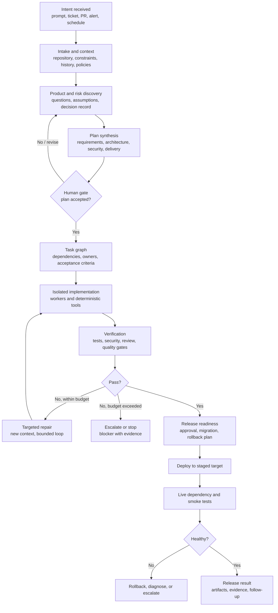
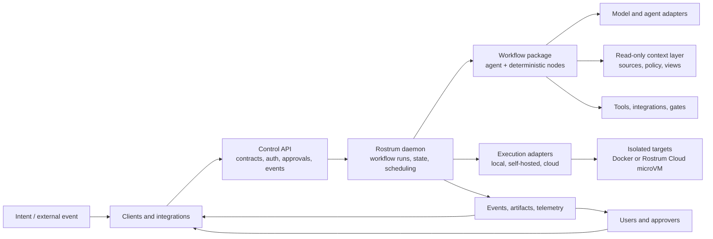

# Rostrum: End-to-End Product Plan

Status: Rough first draft for product and architecture discussion  
Depends on: [High-Level Build Blueprint](rostrum-high-level-build-blueprint.md)  
Audience: Product, engineering, design, security, and operations

## Contents

- [1. North-star outcome](#1-north-star-outcome)
- [2. Product promise](#2-product-promise)
- [3. Users and jobs to be done](#3-users-and-jobs-to-be-done)
- [4. The end-to-end journey](#4-the-end-to-end-journey)
- [5. The product model](#5-the-product-model)
- [6. Human collaboration](#6-human-collaboration)
- [7. Reference software-delivery workflows](#7-reference-software-delivery-workflows)
- [8. Architecture and system boundaries](#8-architecture-and-system-boundaries)
- [9. Open-source and hosted product](#9-open-source-and-hosted-product)
- [10. Trust and safety posture](#10-trust-and-safety-posture)
- [11. Delivery strategy](#11-delivery-strategy)
- [12. Success criteria](#12-success-criteria)
- [13. Product questions to keep open](#13-product-questions-to-keep-open)

## 1. North-star outcome

A user should be able to say:

> Build me a secure note-taking app for mobile, web, and desktop.

Rostrum should transform that request into a governed, inspectable, and resumable delivery process that can:

1. clarify what “secure,” “note-taking,” and “mobile, web, and desktop” mean;
2. ask the user for decisions at the right moments and through the right channels;
3. produce product, security, architecture, and delivery plans;
4. obtain approval for the plan and any high-impact decisions;
5. decompose the plan into a dependency-aware work graph;
6. implement the work in isolated environments;
7. run deterministic tests, security checks, builds, and compatibility checks;
8. route failures into bounded repair loops or human escalation;
9. deploy to controlled environments;
10. run live dependency and smoke tests against the deployed system;
11. report evidence, risks, decisions, and remaining work;
12. stop safely whenever required evidence or approval is missing.

The goal is not “one prompt produces perfect software.” The goal is an autonomous delivery system that can do the work between clear gates, expose its reasoning and evidence, and involve humans where product judgment, risk acceptance, or irreversible action is required.

## 2. Product promise

Rostrum should provide four guarantees at the product level:

### Governed autonomy

Users can delegate a large amount of work without granting an agent unrestricted authority. Every action is constrained by a workflow, policy, workspace, runtime, budget, and approval rule.

### Verifiable progress

Every meaningful transition produces an observable state change and, where possible, evidence: a decision record, plan artifact, diff, test result, security report, deployment record, or live check.

### Durable collaboration

The system keeps working when a user closes a TUI, loses a browser connection, changes devices, or responds later. A user can review and control the same run from multiple channels.

### Portable execution

The same workflow definition should run locally, self-hosted, or through Rostrum Cloud with different execution-target adapters. Local development should not be a fake version of the hosted product.

### Pass-through context

External project context should remain under the customer’s source-system control wherever possible. Rostrum should fetch read-only context just in time, apply policy and redaction, deliver it to the authorized node, and avoid persisting message or documentation bodies by default. Source content storage, caching, or replay snapshots should be explicit opt-in features with visible retention rules.

## 3. Users and jobs to be done

### Product owner or founder

They want to turn an outcome into a usable product without manually translating every idea into requirements, tickets, and acceptance criteria. They need to answer product questions, approve tradeoffs, and understand what will be built.

### Software engineer

They want to delegate routine implementation, testing, maintenance, and review while retaining control over architecture, sensitive changes, and final quality. They need diffs, reproducible runs, and a clear path to intervene.

### Security or compliance reviewer

They want to ensure that requirements, dependencies, secrets, access controls, data handling, and deployment settings satisfy policy before release. They need auditable evidence and approval gates.

### Team or engineering manager

They want visibility into multiple workflows and confidence that autonomous work is bounded, reviewable, and cost-controlled. They need fleet-level status, blockers, budgets, and outcomes.

### Platform or operations engineer

They want to configure environments, integrations, credentials, policies, deployment targets, and observability without modifying every workflow. They need isolation, audit logs, and operational controls.

### External system

CI, Git hosting, monitoring, issue trackers, schedulers, and communication tools need to trigger workflows and receive structured outcomes without pretending to be the workflow engine.

## 4. The end-to-end journey

Rostrum should treat an initiative as a durable project and a run as one execution of a workflow against that project. The journey below is the target product behavior, even if the first release implements only a subset.

### 4.1 Intent and intake

The user can start from a plain-language outcome, structured request, issue, pull request, CI failure, alert, or schedule. Rostrum should normalize the trigger into a project and run context containing the objective, requester, workspace, constraints, policy, and available channels.

The system should not immediately write code when the request is materially ambiguous. It should first identify missing information, retrieve relevant context, and decide whether questions can be answered from available evidence or require a human.

### 4.2 Product and risk discovery

Discovery is a workflow, not a single agent response. It should:

- extract goals, users, constraints, and non-goals;
- identify ambiguity, conflicting requirements, and risky assumptions;
- ask only the questions that change the product or technical plan;
- group questions into a reviewable decision set;
- route questions to the appropriate person or channel;
- record answers, rejected alternatives, and unresolved decisions;
- determine whether the work is safe to plan or needs more information.

For the note-taking example, this stage may ask about authentication, encryption, offline behavior, synchronization, sharing, data residency, recovery, supported platforms, accessibility, and threat model. It should not force the user to answer every possible question before making progress; it should prioritize questions by impact and reversibility.

### 4.3 Plan synthesis

The planning workflow should produce separate but linked artifacts:

- product requirements and user journeys;
- architecture and component boundaries;
- data model and API contracts;
- security and privacy model;
- platform and deployment plan;
- test and quality strategy;
- dependency and licensing assessment;
- implementation task graph;
- release, migration, rollback, and live-validation plan.

The plan is an input contract for implementation. It should be reviewable, versioned, internally consistent, and traceable from user goals to acceptance tests.

### 4.4 Human feedback and approval

Rostrum should distinguish between a question, a review request, an approval gate, and an emergency intervention:

- **Question:** the workflow needs information before choosing a path.
- **Review request:** the workflow has produced an artifact for feedback; work may continue in parallel if policy allows.
- **Approval gate:** the workflow may not cross a defined boundary without an explicit decision.
- **Intervention:** a user pauses, cancels, retries, or changes a run because of an unexpected condition.

Feedback channels should be selected from the urgency, richness, and security of the request:

| Need | Preferred channel | Why |
| --- | --- | --- |
| Rich plan or architecture review | Web panel or TUI | Supports artifacts, diffs, comments, and decision history |
| Quick binary approval | Mobile-friendly web, Slack, or notification action | Low friction for a bounded decision |
| Interactive clarification | TUI, web, or chat integration | Allows a conversational answer tied to the run |
| Security-sensitive approval | Authenticated web/TUI with step-up authentication | Strong identity and auditability |
| Urgent production intervention | Pager/incident integration plus control API | Fast notification and explicit pause/rollback controls |

All channels must write to the same durable decision record. A Slack button or mobile approval is not a separate approval system.

### 4.5 Implementation and verification

Implementation should happen in isolated Docker containers or cloud microVMs using tasks with explicit contracts. Workers should receive only the context view needed for their task plus the relevant plan and acceptance criteria. Deterministic tools should perform file changes, builds, tests, scans, and artifact collection. Each implementation run should work from a source snapshot, create or check out its own branch, and push changes to the configured origin; the user’s host repository is never the execution workspace.

Verification should be independent where possible. It should evaluate the result against the approved plan and executable checks, not merely ask the implementing agent whether it is complete. A failed check should produce structured evidence and a targeted repair task. After configured limits, the workflow must escalate or stop.

### 4.6 Deployment and live dependency testing

Deployment is part of the workflow, not a postscript. The release path should include:

- environment selection and policy checks;
- secret and configuration validation;
- build provenance and artifact promotion;
- database migration or data-change planning;
- staged deployment;
- health and smoke checks;
- live dependency tests against real or controlled external services;
- rollback or forward-fix behavior;
- post-deployment evidence and handoff.

Live dependency testing must be explicit about what data it may create, what systems it may contact, how credentials are scoped, and how failures are reversed. Production execution should require a stronger policy and approval profile than local or staging execution.

## 5. The product model

The core entities should be understandable to both users and the system:

| Entity | Meaning |
| --- | --- |
| Organization | Users, policy, billing, and global settings |
| Project | A durable product or engineering initiative with goals, context, and history |
| Workspace | A codebase, repository set, environment, or data boundary used by a project |
| Context source | An approved external or project information system available through the context layer |
| Context view | A read-only, policy-filtered projection delivered to a node without exposing source credentials |
| Context policy | Rules for which sources, scopes, fields, time ranges, and data classes a node may access |
| Workflow | A reusable workflow graph with contracts, policies, and lifecycle rules |
| Workflow package | The versioned, Git-friendly source and normalized representation of a workflow, including node contracts, policies, context requirements, and simulation fixtures |
| Run | One execution of a workflow against a project, workspace, and trigger |
| Simulation run | A non-production evaluation of a workflow graph using validation, fixtures, mocked side effects, shadow calls, or an ephemeral Docker workspace |
| Node execution | One attempt to execute a graph node, with inputs, outputs, logs, and evidence |
| Task | A planned unit of work with dependencies, acceptance criteria, and status |
| Decision | A question, answer, review, approval, rejection, or override tied to a run |
| Artifact | A plan, diff, report, log, build, deployment record, or other durable output |
| Policy | Rules for tools, data, models, runtimes, approvals, budgets, and side effects |
| Execution target | The isolated environment in which a node or run executes |
| Integration | An external system that triggers, supplies context to, or receives results from Rostrum |

Runs should be event-sourced enough to explain what happened without requiring the original model context to be reconstructed. Artifacts and decisions should remain useful after a run ends.

## 6. Human collaboration

Rostrum should optimize for asynchronous collaboration. Humans should not need to sit in front of a chat window while a workflow performs routine work. The system should make it easy to:

- see what needs attention;
- understand why attention is needed;
- review the smallest useful artifact;
- answer with structured choices or free-form guidance;
- approve only the specific boundary in question;
- return later without losing context;
- change the plan through a new decision rather than an undocumented prompt.

### Decision policy

Each workflow should declare which decisions are:

- automatic when evidence meets a threshold;
- suggested but reviewable;
- always human-approved;
- prohibited.

Examples of always-gated actions include production deployment, destructive migrations, handling of regulated data, adding an unapproved external dependency, modifying identity or payment systems, and expanding network access.

### Feedback quality

Human feedback should be captured as structured state when possible: selected option, rationale, scope, expiration, approver identity, and affected artifacts. Free-form comments remain valuable but should be attached to the relevant decision or artifact rather than living only in chat history.

## 7. Reference software-delivery workflows

The first domain pack should make the following workflows available as reference workflows:

### Product discovery and planning

Input: a product intent or existing issue.  
Output: approved product, architecture, security, test, and delivery plan.  
Mutations: documentation artifacts only until approval.

### Guided feature build

Input: an approved plan or task.  
Output: code changes, tests, evidence, and a reviewable change set.  
Mutations: isolated container or microVM branch; changes are pushed to the configured origin and gated before merge or deployment.

### Review-only

Input: repository, diff, or artifact.  
Output: structured findings, risk assessment, and citations.  
Mutations: none.

### Fast fix

Input: CI failure, issue, or alert.  
Output: narrow patch and deterministic validation.  
Mutations: restricted to an isolated change set; approval based on risk.

### Release and live validation

Input: an approved build artifact and deployment target.  
Output: deployment record, smoke results, live dependency results, and rollback status.  
Mutations: increasingly gated as the target becomes more sensitive.

### Autonomous project delivery

Input: an approved product plan.  
Output: coordinated changes across repositories, environments, and release stages.  
Mutations: bounded by a task graph, worker policies, budgets, and release gates.

## 8. Architecture and system boundaries

The Control API should own identity, project context, policy, workflow versions, approvals, run lifecycle contracts, and client observation/control operations. The Rostrum daemon should own graph execution, scheduling, checkpointing, and execution lifecycle, but generated code should run in an isolated target rather than in the daemon process. The context layer should own read-only source access, filtering, redaction, and provenance. The execution adapters should own isolation and environment provisioning. These boundaries allow a local daemon and Docker target to replace cloud services without changing the workflow or client model.

## 9. Open-source and hosted product

### Open-source foundation

The open-source distribution should be capable of meaningful local and self-hosted use:

- workflow graph schema;
- context source, policy, view, and provenance contracts;
- graph validation and authoring tools;
- visual graph authoring and simulation;
- orchestration runtime;
- node and adapter SDKs;
- deterministic tools and policy interfaces;
- local state, events, artifacts, and telemetry;
- Docker-based local and self-hosted execution;
- self-hostable daemon and Control API;
- web control panel, CLI, SDK, and optional TUI;
- reference software-delivery workflows;
- conformance tests and local development assets.

### Hosted product

The hosted product should provide operational leverage, not a proprietary replacement for the workflow model:

- managed multi-tenant control plane;
- remote scheduling and fleet coordination;
- Rostrum Cloud microVM fleet;
- credential brokering and enterprise identity;
- hosted integrations and event ingestion;
- retention, audit, notifications, and operational observability;
- usage metering, quotas, billing, and support.

The open/cloud boundary should be enforced through public contracts and replaceable implementations. A user should be able to migrate a workflow from local to hosted execution without rewriting its business logic.

## 10. Trust and safety posture

Rostrum should assume that model output, external content, dependencies, and generated code can be wrong or malicious. The platform should be designed around least privilege and evidence:

- no model receives long-lived integration secrets directly;
- tools authenticate separately and receive scoped, ephemeral credentials;
- untrusted code runs outside the core control plane;
- every side effect is attributable to a run, node, policy, and identity;
- approval gates are cryptographically attributable and auditable;
- budgets and kill switches exist at organization, project, run, and node levels;
- prompt-injected instructions cannot expand a node’s declared authority;
- source-system credentials are held by context connectors, never passed to agents;
- external context bodies are not persisted by default;
- artifacts and logs are tamper-evident enough for operational review;
- deployment and data-changing operations have explicit environment policy.

Safety should degrade toward stopping, not toward silently continuing.

## 11. Delivery strategy

### Horizon 1: prove the loop locally

Deliver a local daemon, Control API, canonical workflow package, read-only context layer, durable run record, deterministic tool runner, Docker target, web graph editor/simulator, optional TUI, and planning/review/guided-build workflows. The target proof is: a user or model can propose a workflow, a user can inspect and simulate it, then plan a small feature, approve it, implement it in an isolated container branch, run tests, push the result to an origin, see a bounded repair loop, and inspect the result after reconnecting.

### Horizon 2: make execution dependable

Add event replay, artifact storage, policy gates, independent verification, structured escalation, SDK/CLI contracts, and a stable execution-target interface.

### Horizon 3: add shared control surfaces and triggers

Add web control, mobile-friendly approvals, repository/CI triggers, first integrations, notifications, and project/run history.

### Horizon 4: add hosted execution

Add tenancy, Rostrum Cloud microVM execution, remote execution, credential brokering, enterprise identity, metering, quotas, billing, and operational controls. Keep self-hosted deployments Docker-only.

### Horizon 5: expand from feature work to product delivery

Add multi-repository task graphs, environment promotion, deployment/live validation, autonomous project workflows, reusable domain packs, and fleet-scale operations.

### Horizon 6: generalize the workflow platform

Extract domain-specific nodes and workflows from the core. Keep the execution, policy, artifact, approval, and integration abstractions general enough for domains beyond software development.

## 12. Success criteria

The first meaningful success criteria are behavioral:

- A user can start a workflow from a plain-language software goal.
- Rostrum can ask clarifying questions and associate answers with the run.
- Rostrum produces a plan that is traceable to requirements and acceptance checks.
- No implementation begins before the declared approval condition is satisfied.
- Implementation and verification occur in bounded, observable loops.
- The system can resume after a client disconnect or process restart.
- A user can inspect artifacts, evidence, and blockers from the TUI or web surface.
- A user can visually edit a workflow, simulate it without unintended side effects, and publish a version only after validation.
- A model can propose a workflow that is rendered, validated, simulated, and presented for human review before execution.
- The CLI and SDK can start runs asynchronously, observe events, wait for approvals or terminal outcomes, control runs, and retrieve artifacts.
- A workflow can run against at least one local and one isolated execution target.
- Release workflows can deploy to a non-production environment and run live smoke/dependency checks.
- Every externally visible side effect has an identity, policy, and audit record.
- The same workflow contract works locally and in the hosted architecture.

## 13. Product questions to keep open

1. How much product discovery should Rostrum conduct autonomously before it asks a question?
2. Should user questions be generated by a dedicated discovery graph, a reusable node, or a general workflow primitive?
3. How should conflicting human feedback from different channels be resolved?
4. Which artifacts are authoritative when a plan, issue tracker, and repository disagree?
5. What is the minimum evidence required before a node can claim completion?
6. How should Rostrum handle live dependencies that are flaky, rate-limited, or unavailable?
7. How do users express risk tolerance and acceptable autonomy at the project and environment level?
8. Should release/deployment workflows live in the core platform or in a software-development domain pack?
9. How much of the hosted control plane can be open-source without exposing the operationally sensitive service layer?
10. What is the first non-software domain that would validate the generality of Rostrum without expanding the first release too far?
