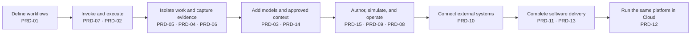

# Rostrum: Platform Product Plan

Status: Rough first draft for product and architecture discussion  
Depends on: [High-Level Build Blueprint](rostrum-high-level-build-blueprint.md)  
Audience: Product, engineering, design, security, and operations

## Purpose

The [High-Level Build Blueprint](rostrum-high-level-build-blueprint.md) explains Rostrum’s conceptual architecture and major boundaries.

This document answers a narrower question:

> What are we building, why does each part exist, and in what order should we build it?

Rostrum is a platform for defining and executing workflows. It receives an explicitly selected workflow and structured inputs. 

## Contents

- [1. Product scope](#1-product-scope)
- [2. What we are building and why](#2-what-we-are-building-and-why)
- [3. PRD roadmap](#3-prd-roadmap)
- [4. Example workflow suite](#4-example-workflow-suite)
- [5. Product roadmap](#5-product-roadmap)
- [6. Product boundaries](#6-product-boundaries)
- [7. Definition of a complete product](#7-definition-of-a-complete-product)
- [8. Open decisions](#8-open-decisions)

## 1. Product scope

### Core product

- Define, validate, simulate, publish, and version workflows.
- Execute workflow graphs durably and safely.
- Combine model, deterministic, script, integration, approval, and control nodes.
- Pass typed, bounded outputs between nodes.
- Provide read-only, pass-through access to approved external context.
- Isolate code, scripts, and tools in Docker or Cloud microVMs.
- Expose one Control API to all clients and integrations.
- Record state, events, artifacts, policy decisions, and evidence.

### Not core product behavior

- General-purpose chat or prompt intake.
- Automatically deciding which workflow to run without an explicitly configured workflow or integration.
- A single mandatory domain, such as software development.
- Workflow packaging, marketplace distribution, signing, or monetization in the first planning phase.

## 2. What we are building and why

| Product area | What we build | Why it exists |
| --- | --- | --- |
| Workflow definition | Versioned graphs with schemas, branches, loops, approvals, policies, and completion conditions | Makes automation explicit, reviewable, and repeatable |
| Authoring and simulation | Visual graph editor, validation, simulation, version comparison, and publication flow | Lets people safely understand and modify workflows before execution |
| Rostrum daemon | Durable scheduler and graph executor with retries, checkpoints, waits, and recovery | Keeps work running correctly when clients disconnect or processes fail |
| Control API | Contracts for workflow versions, invocation, observation, control, approvals, artifacts, and configuration | Gives every client and integration one source of truth |
| Web control panel | Primary workflow authoring, simulation, review, and run-management interface | Makes complex graphs and evidence understandable |
| TUI | Optional terminal client for fast observation and operational control | Supports local development and remote operations |
| CLI and SDK | Scriptable workflow validation, simulation, invocation, waiting, observation, control, and artifact access | Enables CI, automation, and integration with other systems |
| Model runtime | Provider-neutral model nodes with structured outputs, context boundaries, usage tracking, and configurable model execution strategies | Adds reasoning without making models the source of workflow truth |
| Deterministic tools and scripts | File/process/test/integration tools plus sandboxed scripts with typed stdout/JSON/JSONL piping | Handles literal work reproducibly and supplies machine-readable evidence |
| Context Layer | Read-only, policy-filtered, just-in-time access to repositories, Slack, Discord, documentation, incidents, and other sources | Provides useful context without passing credentials or creating a mandatory data cache |
| Sandboxing | Docker for local/self-hosted execution; microVMs for Rostrum Cloud | Keeps generated code, scripts, tools, and credentials outside the daemon and user host |
| State and observability | Durable run state, event streams, artifacts, traces, usage, and audit records | Enables recovery, debugging, review, and trust |
| Governance and approvals | Users, teams, groups, projects, policies, budgets, credentials, approvals, and kill switches | Makes automation safe to operate at meaningful scale |
| Integrations | Triggers, callbacks, notifications, external jobs, and result publishing | Connects workflows to existing systems without bypassing Rostrum’s contracts |

Detailed requirements for these areas belong in the PRDs. This plan only defines their product purpose and order.

## 3. PRD roadmap

Each stage below leaves Rostrum in a more capable, demonstrable state. The linked PRDs are the documents needed to reach that state.

| Product state | PRDs | What can be demonstrated |
| --- | --- | --- |
| A workflow exists | [PRD-01: Workflow definition](../prds/prd-01-workflow-definition.md) | A versioned graph declares inputs, outputs, node contracts, policies, branches, approvals, and completion conditions. |
| A workflow can run | [PRD-07: Control API and local daemon](../prds/prd-07-control-plane-api-and-local-daemon.md) · [PRD-02: Durable orchestration runtime](../prds/prd-02-durable-orchestration-runtime.md) | A caller invokes a selected workflow through one API; the daemon schedules it, waits, retries, branches, joins, and recovers. |
| A workflow can safely do work | [PRD-05: Execution targets and sandboxing](../prds/prd-05-execution-targets-and-sandboxing.md) · [PRD-04: Deterministic tools and policy gates](../prds/prd-04-deterministic-tools-and-policy.md) · [PRD-06: State, events, artifacts, and observability](../prds/prd-06-state-events-artifacts-observability.md) | A Docker-isolated run executes tools and scripts, pipes typed results, enforces policy, and leaves recoverable evidence and artifacts. |
| A workflow can reason with controlled context | [PRD-03: Agent and model runtime](../prds/prd-03-agent-and-model-runtime.md) · [PRD-14: Context Layer](../prds/prd-14-context-layer.md) | Model nodes use declared context and model strategies; approved source data is passed through without exposing credentials or requiring a source-content cache. |
| A workflow can be created and governed | [PRD-15: Workflow authoring and simulation](../prds/prd-15-workflow-authoring-and-simulation.md) · [PRD-09: Web control panel and mobile approvals](../prds/prd-09-web-control-panel-and-mobile.md) · [PRD-08: TUI console](../prds/prd-08-tui-console.md) | A user edits a graph visually, validates and simulates it, publishes a version, observes runs, reviews evidence, and handles decisions from web, mobile, or terminal clients. |
| A workflow can participate in a system | [PRD-10: Triggers and integrations](../prds/prd-10-triggers-and-integrations.md) | A repository, CI system, schedule, alert, or external application starts a selected workflow and receives structured results. |
| A workflow can deliver software | [PRD-11: Software delivery workflow collection](../prds/prd-11-software-delivery-workflows.md) · [PRD-13: Deployment, release, and live validation](../prds/prd-13-deployment-release-and-live-validation.md) | An explicitly supplied software task can pass through planning, isolated implementation, verification, deployment, live dependency testing, approval, and rollback or escalation. |
| Rostrum can be operated as Cloud | [PRD-12: Hosted governance, identity, and usage](../prds/prd-12-hosted-governance-identity-and-usage.md) | The same workflow definitions and Control API run across tenants with managed identity, credentials, quotas, operations, billing, and microVM isolation. |

The [PRD index](../prds/README.md) is the entry point for the detailed documents. The [Epics index](../epics/README.md) then breaks each PRD into implementation tasks and SPIKEs.

## 4. Example workflow suite

Rostrum should be evaluated through a suite of workflows rather than one showcase. These examples define the capabilities the product must eventually demonstrate.

| Example workflow | Inputs | Why it matters |
| --- | --- | --- |
| Structured script pipeline | Records, files, or bounded text | Proves sandboxed scripts, typed piping, limits, retries, and artifacts |
| Model execution with context transition | A declared task, context policy, and model strategy | Proves multi-model execution, context management, fallback, and usage tracking |
| Pass-through context review | Source selector, review contract, and output schema | Proves credential isolation, redaction, provenance, and no-body-persistence defaults |
| Human approval and callback | Proposed action and approver policy | Proves durable waits, approval groups, expiry, rejection, resume, and callbacks |
| Fan-out, join, retry, and compensation | Collection of items and a result policy | Proves parallelism, partial failure, bounded retries, aggregation, and recovery |
| Optional workflow router/decider | Prompt/event envelope and allowed workflow registry | Proves prompt-driven behavior can be built on Rostrum without making intake implicit |
| Guided software build | Product brief or approved task | Proves planning, isolated implementation, Git handoff, verification, and review gates |
| Release and live validation | Approved artifact, environment, and dependency policy | Proves deployment, migrations, smoke tests, live dependencies, rollback, and evidence |
| Research and evidence brief | Research question, source policy, and output schema | Proves context retrieval, parallel work, synthesis, citations, and review |
| Incident investigation/remediation | Alert envelope, service scope, and remediation policy | Proves diagnosis, scripts/tools, approvals, staged changes, and monitoring follow-up |
| Data synchronization with exceptions | Source records, destination policy, and reconciliation rules | Proves idempotency, transformations, per-record failure, and reconciliation reporting |

Software development is the first workflow collection because it is a demanding validation case. The secure note-taking app remains its reference fixture, not Rostrum’s product definition.

## 5. Product roadmap

| Phase | Build | Exit condition |
| --- | --- | --- |
| 1. Generic local execution | Workflow schema, structured invocation, validator, local daemon, Control API, Docker target, deterministic tools/scripts, state/events, artifacts | A caller can invoke and inspect a simple workflow locally |
| 2. Authoring and execution depth | Web authoring, simulation, publication/versioning, typed piping, model execution strategies, policy enforcement, CLI/SDK lifecycle | A workflow can be authored, simulated, approved, executed, paused, resumed, and reviewed |
| 3. Core completeness suite | Script pipeline, context review, approvals/callbacks, fan-out/retry, and optional router/decider workflows | Core platform primitives work together across representative workflows |
| 4. Software workflow collection | Planning, implementation, verification, deployment, and live validation; secure note-taking fixture | A complete software-delivery path works through isolated execution and evidence gates |
| 5. Generality validation | Research, incident-response, and/or synchronization workflows | At least two non-software workflows use the same core contracts |
| 6. Rostrum Cloud | Hosted tenancy, credential brokering, quotas, operations, billing, and microVM execution | The same workflow contracts work in Cloud with stronger hosted isolation |

## 6. Product boundaries

### Open-source/self-hosted core

- Workflow definitions, validation, authoring, and simulation.
- Rostrum daemon and Control API.
- Web panel, CLI, SDK, and TUI.
- Context Layer contracts and self-hosted broker/connectors.
- Deterministic tools, sandboxed scripts, and model/runtime interfaces.
- Docker execution, local state, events, artifacts, telemetry, and conformance tests.
- Reference workflow collections and example fixtures.

### Rostrum Cloud capabilities

- Managed tenancy, identity, credentials, retention, notifications, and operations.
- Hosted integrations and usage/billing services.
- Rostrum Cloud microVM execution and fleet management.

Packaging, installation, signing, distribution, marketplace behavior, and monetization of workflow collections are deferred decisions.

## 7. Definition of a complete product

Rostrum is a complete first product when:

- a caller can invoke a versioned workflow with schema-validated inputs;
- the workflow can be inspected, simulated, approved, and executed through the shared contracts;
- model, deterministic, script, human, and integration nodes work together;
- scripts and tools can produce bounded, typed downstream inputs;
- context can be accessed without exposing source credentials or persisting source bodies by default;
- runs survive client and daemon interruptions;
- users can inspect evidence, artifacts, policies, costs, and failures;
- the software workflow collection completes the reference application path;
- at least two non-software workflows run without changing the core execution model;
- the same workflow definition can run locally/self-hosted with Docker and in Rostrum Cloud with microVMs.

## 8. Open decisions

1. Which functionality belongs in the core versus a workflow collection or optional client?
2. Which script runtimes and output formats should be supported first?
3. What simulation levels are required before execution for each risk class?
4. What state/event guarantees are required for retries, callbacks, and external side effects?
5. How should model providers, runnable dependencies, and credentials be resolved in Docker and Cloud?
6. Which two non-software workflows should follow the software collection?
