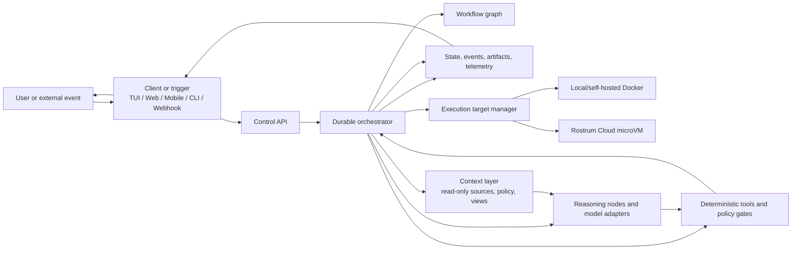

# Rostrum: High-Level Build Blueprint

Status: Draft for architecture and product discussion  
Source: [AI Workflow Engine Market Research - synthesis](../research/ai-workflow-engine-market-research-synthesis.md)  
Audience: Founders, product, engineering, and design

## Contents

- [1. Executive summary](#1-executive-summary)
- [2. The problem Rostrum solves](#2-the-problem-rostrum-solves)
- [3. Product concept: workflows as reusable execution graphs](#3-product-concept-workflows-as-reusable-execution-graphs)
- [4. What needs to be built](#4-what-needs-to-be-built)
- [5. How the pieces interact](#5-how-the-pieces-interact)
- [6. Open-source and cloud boundary](#6-open-source-and-cloud-boundary)
- [7. Recommended build shape](#7-recommended-build-shape)
- [8. What is intentionally deferred to the deeper PRDs](#8-what-is-intentionally-deferred-to-the-deeper-prds)
- [9. Decisions to facilitate next](#9-decisions-to-facilitate-next)
- [10. Working definition of done for the product concept](#10-working-definition-of-done-for-the-product-concept)

## 1. Executive summary

Rostrum should be a workflow engine for reliable software-engineering automation. A Rostrum “workflow” is a reusable, versioned workflow graph rather than a system prompt or an open-ended chat session. The graph combines specialized reasoning nodes with deterministic nodes for operations that must be literal, inspectable, and repeatable.

The product should make it possible to define a workflow once and run it from several places: a local terminal, a web control panel, a mobile-friendly surface, an API, or an external event such as a pull request, CI failure, or production alert. The workflow itself should not depend on any one interface. Every surface should be a client of the same execution system.

The core product is therefore the execution lifecycle:

1. Accept a request or event.
2. Resolve a workflow and its inputs.
3. Build or load the workflow graph.
4. Execute the graph durably across bounded loops and isolated runtimes.
5. Persist state, logs, decisions, and artifacts.
6. Pause for policy decisions or human approval when required.
7. Expose progress and controls to users.
8. Produce a verifiable result, not merely a final answer.

The market research strongly supports this direction: reliability comes from graph constraints, typed handoffs, deterministic verification, durable checkpoints, isolated execution, and a clear separation between orchestration and user interface.

## 2. The problem Rostrum solves

Most coding agents combine planning, tool use, implementation, testing, and explanation inside one loosely controlled reasoning loop. That is convenient for small tasks but difficult to trust for important work. The failure modes Rostrum is intended to address are:

- unclear or hallucinated sequencing of work;
- agents deciding when to stop without an enforceable completion condition;
- runaway retries and uncontrolled cost;
- one agent validating its own assumptions;
- lost state when work is paused or the interface disconnects;
- unsafe commands, credentials, and generated code running in the wrong environment;
- poor visibility into what a remote or parallel workflow is doing;
- workflows that cannot be reused consistently across local and hosted execution.

Rostrum’s value is to turn an unpredictable model interaction into a governed execution process. The model can still reason, propose, and adapt, but the system determines what it is allowed to do, what it must hand off, what evidence is required, and when the workflow is complete or blocked.

## 3. Product concept: workflows as reusable execution graphs

A workflow is Rostrum’s primary unit of behavior. It packages:

- a workflow graph of nodes, branches, loops, and completion conditions;
- input and output contracts between nodes;
- the agents, models, tools, and policies available to each node;
- the runtime target and resource limits;
- approval requirements and escalation behavior;
- the artifacts and evidence the workflow must produce.

Workflows should be composable and versioned. A workflow can be run repeatedly against different repositories, issues, alerts, or feature requests without changing the fundamental execution semantics.

The initial workflow families should represent distinct operating constraints rather than merely different prompts:

| Workflow family | What it is for | Defining constraint |
| --- | --- | --- |
| Review-only | Analyze a change, repository, or design and return findings | Read-only; no source mutation |
| Planning | Produce requirements, architecture, risks, and an implementation plan | Documentation artifacts only |
| Guided build | Implement an approved plan through verification and correction | Approval before mutation and bounded fix loops |
| Fast fix | Resolve a narrowly scoped failure or maintenance task | Minimal planning; narrow blast radius |
| Autonomous project | Coordinate a large body of dependent work | Explicit task graph, worker isolation, and release gates |

These workflows cover the core examples in the research while leaving room for future domains outside software engineering.

## 4. What needs to be built

### 4.1 Workflow definition and graph model

Rostrum needs an open workflow model that can express sequential work, branching, parallel fan-out, joins, cycles, retries, approvals, timeouts, and escalation. It should be possible to inspect a workflow as a graph and validate it before execution.

This layer is the stable contract between all Rostrum deployments and interfaces. It should support typed state, structured node inputs and outputs, explicit side effects, and a clear distinction between “reasoning” and “execution.”

### 4.2 Durable orchestration runtime

The orchestration runtime is the system that executes a workflow. At a high level it needs to:

- schedule ready nodes and manage dependencies;
- persist checkpoints and resume after interruption;
- manage parallel branches and child workflows;
- enforce time, attempt, token, and financial budgets;
- route failures through retry, fix, escalation, or halt paths;
- wait for human approvals without losing state;
- emit a consistent event stream for interfaces and integrations;
- record the evidence needed to explain why a workflow succeeded, failed, or stopped.

This is the central product capability. Interfaces, triggers, and execution targets should invoke and observe it rather than reimplement it.

### 4.3 Agent and model runtime

Rostrum needs an adapter layer for reasoning nodes. It should provide a consistent way to call different models and agent implementations while preserving structured contracts, context boundaries, and usage accounting.

The runtime should support fresh contexts for separate roles such as product, architecture, implementation, and verification. A verifier should be able to evaluate an artifact against an original contract without inheriting the implementer’s assumptions.

### 4.4 Context layer

Rostrum needs a first-class, read-only context layer that lets workflows declare which project information an agent may access without handing source-system credentials to the agent. Context sources may include repositories, issue trackers, Slack, Discord, documentation sites, incident systems, and other approved systems.

The context layer should be as pass-through as possible. A context connector authenticates to the source, retrieves only the permitted material, applies policy and redaction, and delivers a context view or bundle to the node. Rostrum should not persist source content or maintain a general-purpose cache by default. It may retain connection metadata, provenance, hashes, policy decisions, and redacted operational metadata. Persisting source content should require explicit opt-in and retention policy.

The context layer should remain read-only in the first product scope. Context access and external write actions are separate concerns: a workflow may later publish a result through an integration, but agents should not receive write access merely because they can read context.

The context layer needs four conceptual parts:

- **Context source:** a connector to an external system.
- **Context policy:** the allowed source, scope, fields, time range, data classification, and node access.
- **Context view:** the filtered and redacted data delivered to a node.
- **Context provenance:** source identity, retrieval time, selectors, and integrity metadata.

### 4.5 Deterministic tool and policy runtime

Deterministic nodes are first-class workflow components. They should cover the operations that should not be delegated to model judgment, including:

- reading and writing files under an explicit workspace policy;
- Git branch, commit, diff, and remote operations;
- test, build, lint, and security commands;
- repository and issue context loading;
- artifact collection and transformation;
- branching on structured results such as exit codes or policy checks;
- approval and notification actions;
- external API calls through controlled integrations.

Every tool invocation needs an explicit boundary: allowed inputs, side effects, credentials, runtime target, timeout, and approval policy. This is also where Rostrum turns raw command output into structured observations for later nodes.

### 4.6 Execution target and sandbox layer

The same workflow should be runnable in multiple environments, chosen according to trust, cost, speed, and hardware needs. Rostrum should treat execution targets as replaceable adapters behind a common contract.

The initial target spectrum should be intentionally small:

- Docker for local and self-hosted execution;
- microVMs for Rostrum Cloud execution.

Each implementation run or parallel task gets its own container or microVM, separate from the user’s host repository and machine. Git branches, commits, diffs, and pushes remain useful for change tracking and collaboration, but Git worktrees are not the isolation mechanism. The execution target receives a source snapshot, creates or checks out a branch, and pushes the resulting branch or commit to the configured origin according to policy.

The sandbox layer should provision a workspace, mount only the required data, expose approved tools, isolate credentials, collect logs and artifacts, and destroy or recycle the environment according to policy.

### 4.7 State, event, artifact, and telemetry services

Durable workflows require more than a job queue. Rostrum needs a persistent execution record containing graph state, node attempts, inputs, outputs, approvals, tool calls, costs, logs, and artifacts.

An event stream should make the execution record observable in real time. Artifacts should be addressable independently of a chat transcript, since plans, diffs, test reports, logs, and review findings are products of the workflow and may be inspected or approved before continuation. External context bodies should not be persisted as ordinary artifacts unless a user or policy explicitly requests that behavior.

### 4.8 Control API and service boundary

The backend API is the boundary that allows every client and trigger to use the same product. At a high level it should support:

- registering and versioning workflows;
- starting, pausing, resuming, canceling, and retrying runs;
- subscribing to run events;
- inspecting graph state, node traces, approvals, and artifacts;
- submitting approval decisions;
- managing workspaces, projects, credentials, policies, and runtime targets;
- managing context sources, context policies, and context provenance;
- receiving external events and reporting outcomes.

For local use, this may be a local daemon or embedded service. For hosted use, it becomes the tenant-aware control plane and routes work to remote execution infrastructure.

### 4.9 User interfaces and clients

Rostrum should have multiple clients over the same API rather than multiple sources of truth.

#### TUI: the local and remote mission-control console

The TUI should be the first serious client because it is natural for developers and works well for local workflows. Its responsibility is observability and control:

- show all active and historical runs;
- render the workflow graph, current node, branches, loops, and progress;
- stream agent activity, tool calls, outputs, and deterministic results;
- inspect artifacts, diffs, logs, and failure evidence;
- surface approval requests, policy violations, and blockers;
- pause, resume, retry, or abort according to the user’s permissions;
- detach from a run and reattach later, including to a remotely executing run.

The TUI must not own workflow state, business logic, scheduling, model calls, or the authoritative approval record. It may issue commands through the control API, but the backend must remain correct if the TUI closes or is replaced by the web client.

#### Web control panel

The web application should provide a broader control plane for configuring workflows, workspaces, policies, integrations, runtime targets, users, and usage. It should also provide a richer view of run history, artifacts, approvals, and fleet-level activity.

The web app is therefore connected to the TUI through the same backend contracts and event model. They are separate presentation clients, not separate workflow systems.

#### Mobile-friendly access

Mobile should initially be treated as a responsive control and approval surface, not as a third execution environment. Its highest-value actions are receiving notifications, inspecting a concise run status, reviewing an artifact or approval request, and pausing or approving an execution. A native mobile application can be considered later if usage warrants it.

#### CLI, SDK, and integration clients

The CLI and SDK should make Rostrum usable in scripts, CI, developer tooling, and internal platforms. Webhooks and chat or incident integrations should invoke the same API rather than bypassing the orchestration runtime.

### 4.10 Triggers and integrations

Rostrum should be event-driven as well as manually invoked. Important trigger categories include:

- developer prompts through the CLI, TUI, or web panel;
- Git repository and pull-request events;
- CI failures and deployment events;
- observability or incident alerts;
- commits, file changes, and scheduled jobs;
- messages or commands from collaboration tools;
- API calls from another engineering system.

Integrations should translate external events into normalized Rostrum inputs and publish structured outcomes back to the originating system.

### 4.11 Governance, identity, and usage accounting

Rostrum needs a governance layer before autonomous workflows can safely operate at scale. At a high level this includes:

- users, teams, projects, and permissions;
- policies for tools, files, networks, models, and runtimes;
- ephemeral execution identities and isolated credentials;
- approval and audit records;
- quotas, budgets, rate limits, and kill switches;
- usage metering for model tokens, node executions, runtime time, and storage;
- billing integration for hosted service usage.

Governance is not an administrative add-on. It is part of the execution contract because the graph must know what it is allowed to do and what evidence is required before it can continue.

## 5. How the pieces interact

The intended relationship is a shared execution core with replaceable clients, triggers, and runtimes.

The important architectural rule is that the TUI, web panel, mobile surface, and integrations all observe the same run record and send commands to the same control API. A run must continue if a client disconnects. A workflow must behave the same way whether it was started by a human, a webhook, or a scheduled trigger, subject only to the selected policy and runtime.

## 6. Open-source and cloud boundary

Rostrum should be open-source wherever the capability can run locally or be self-hosted. This keeps the workflow model portable, makes the execution contract auditable, and allows teams to adopt Rostrum without committing immediately to the hosted service.

### Open-source core

- workflow graph specification;
- context source, policy, view, and provenance contracts;
- workflow validation, compilation, and local authoring tools;
- orchestration runtime and durable execution model;
- node, tool, model, and integration adapter interfaces;
- deterministic tool and policy framework;
- local and self-hosted Docker execution targets;
- local state, event, artifact, and telemetry implementations;
- CLI and TUI;
- self-hostable control API and web control panel where practical;
- reference integrations and development tooling;
- conformance tests and example workflows.

### Cloud or closed-source services

- Rostrum-hosted multi-tenant control plane;
- managed scheduling, fleet coordination, and hosted execution;
- Rostrum Cloud microVM fleet infrastructure;
- hosted identity, secret storage, credential brokering, and enterprise policy services;
- hosted event ingestion, notifications, and operational observability;
- usage metering, billing, quotas, and account administration for the SaaS product;
- cloud-only proprietary integrations, operational tooling, and premium service features.

The boundary should be an implementation boundary, not a different product model. The hosted service should run the same public workflow definitions and use the same client-facing contracts wherever possible. Cloud-only behavior should be expressed as replaceable services behind documented interfaces.

## 7. Recommended build shape

The build should proceed as vertical slices that prove the execution model early.

### Phase 1: Local workflow slice

Build a minimal workflow format, read-only context layer, durable local orchestrator, typed node contracts, deterministic tool runner, Docker workspace target, and TUI. Prove planning, review-only, and guided-build flows end to end with pause/resume and a bounded verify-fix loop.

### Phase 2: Reliable execution foundation

Add stronger checkpointing, event replay, artifact storage, policy enforcement, independent verifier contexts, structured failure and escalation paths, and a stable control API. Make the TUI reconnectable and independent of the process that started the run.

### Phase 3: Shared clients and triggers

Build the web control panel, responsive approval views, CLI/SDK improvements, repository and CI triggers, and the first outbound integration. Ensure all clients use the same run, event, artifact, and approval contracts.

### Phase 4: Hosted execution and governance

Introduce tenant boundaries, managed credentials, ephemeral identities, Rostrum Cloud microVM execution, remote scheduling, metering, quotas, and SaaS account management. Keep Docker-based local and self-hosted execution viable throughout this phase.

### Phase 5: Fleet-scale workflows

Expand autonomous project work, distributed worker pools, cross-repository coordination, advanced scheduling, reusable subgraphs, richer release gates, and operational tooling for large concurrent workloads.

This sequencing keeps the riskiest product assumptions visible: whether graph-based workflows are expressive enough, whether durable execution feels usable, whether the TUI provides sufficient trust, and whether the local-to-cloud execution contract is genuinely portable.

## 8. What is intentionally deferred to the deeper PRDs

This blueprint does not yet specify detailed screens, endpoint schemas, database tables, node-by-node behavior, model prompts, specific Docker/microVM implementations, pricing, or implementation tickets. Those belong in the next layer of planning.

The next PRDs should resolve, for each product area:

- target users and concrete use cases;
- required capabilities and non-goals;
- user journeys and workflow examples;
- functional and safety requirements;
- local, self-hosted, and cloud behavior;
- open-source ownership and service boundaries;
- success criteria and failure conditions;
- dependencies, technical risks, and likely SPIKEs.

The first PRDs should likely cover the workflow definition, context layer, orchestration runtime, deterministic tool and policy system, execution targets, control API, TUI, web control panel, triggers/integrations, and hosted governance services.

## 9. Decisions to facilitate next

The most important discussion questions are architectural rather than cosmetic:

1. What is the canonical workflow definition format, and how much should be declarative versus code-based?
2. Is the first runtime embedded in a CLI/TUI process, or is a local daemon the primary unit from the beginning?
3. What state and event guarantees are required for pause/resume, replay, and exactly-once versus at-least-once tool execution?
4. Which side effects require approval, and how are approvals scoped, authenticated, and audited?
5. What is the minimum safe execution target for local development, and what must be true before hosted untrusted execution is offered?
6. Which parts of the web control panel are configuration/control-plane functions versus run-observability functions?
7. How should model providers, credentials, tools, and integrations be packaged and versioned?
8. What should be a first-class artifact, and how long should execution history and artifacts be retained?
9. What is the smallest vertical slice that demonstrates Rostrum’s advantage over a conventional coding-agent loop?
10. Which cloud capabilities are necessary for the first hosted release, and which can remain self-hosted or deferred?

## 10. Working definition of done for the product concept

At a high level, Rostrum is on the right track when a user can define or select a workflow, start it from any supported client or trigger, watch a durable graph execute across agent and deterministic nodes, inspect the evidence produced at each step, approve or reject gated actions, recover from a disconnected client, and receive a verifiable final result. The same workflow should be able to run locally and, behind the same contracts, on Rostrum’s hosted infrastructure.
